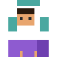
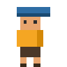
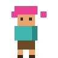
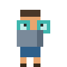
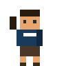
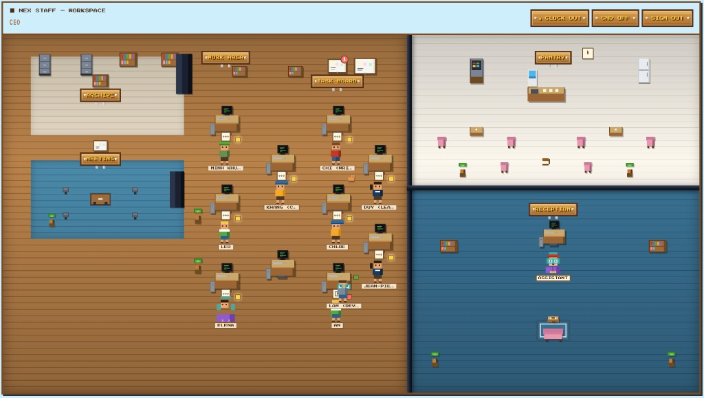
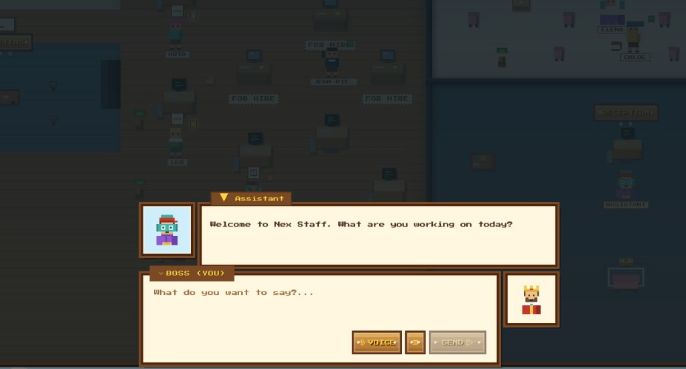
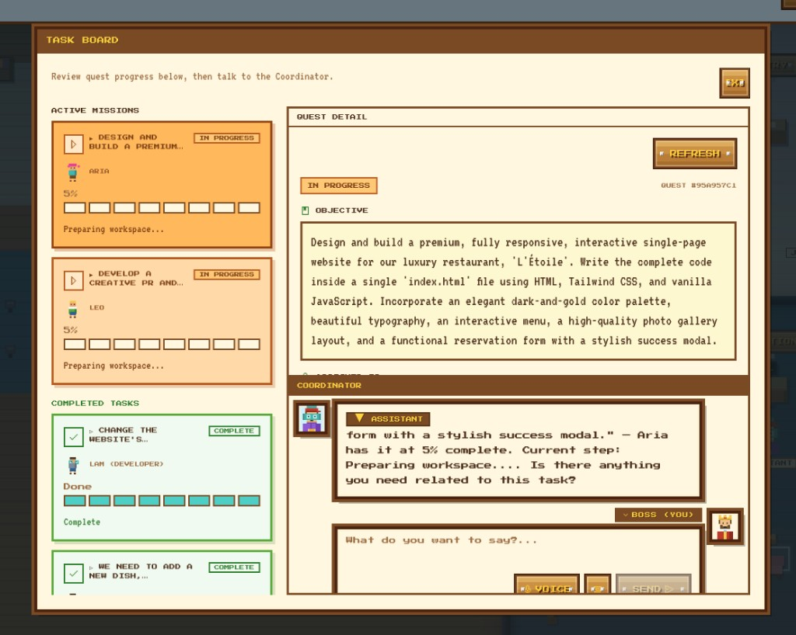

# Nex Staff

**Build a team. Ship your project. Stay in the game.**

Nex Staff is a web platform for **solo founders** who need a company-sized skill set on a one-person budget — and a journey that doesn't grind them down. Most tools help you *work* alone. We help you feel like you're **building with a team**, so you keep showing up.

<p align="center">
  
  
  
  
  
  
  
</p>



---

## The problem

Solo founders wear every hat: product, marketing, content, research, coding, ops. Most can't afford a real team. Generic AI chat helps in the moment, but it doesn't feel like *having people* — you still wait, context-switch, and carry the mental load yourself.

Over weeks and months, that isolation turns into something worse than being busy: **boredom and burnout**. Same blank doc. Same stuck feature. No one to high-five when something ships. Many solo founders don't quit because the idea failed — they quit because the journey felt **lonely, repetitive, and draining**.

That leads to a familiar spiral:


| Struggle                     | What it feels like                                                                          |
| ---------------------------- | ------------------------------------------------------------------------------------------- |
| **No depth in every field**  | You need a blog, a landing page, and a data pull — but you're strong in none of them        |
| **Low budget**               | Contractors and agencies are out of reach; every tool is another subscription               |
| **No time**                  | Side project nights disappear into research rabbit holes and half-finished drafts           |
| **Boredom & demoralization** | The grind feels endless — no teammates, no visible wins, no reason to open the app tomorrow |


Current AI products treat you like a power user in a terminal. Nex Staff treats you like a **boss with a staff** — and gives you an office worth coming back to.

---

## Who this is for

**Solo founders** — indie hackers, first-time builders, side-project operators — who:

- Have an idea or product in motion and need output across multiple disciplines
- Want to **delegate**, not prompt-engineer every task from scratch
- Prefer conversation and a sense of progress over dashboards and API keys
- Are tired of **solo grind** — the quiet evenings, the stalled momentum, the feeling that nobody else is in the room
- Need the journey to stay **alive and motivating**, not another chore they eventually abandon

---

## How we solve it

You run a **pixel office** — not a spreadsheet with a chat box. An **Assistant** is your coordinator at Reception. You walk the floor, see who's working, hire specialists, and delegate quests. Staff work **async in the background**; when they finish, you get a **quest complete** moment — a notification, a walk-in, a deliverable to open. Small wins stack up. The project moves. **You stay in the game.**



```
You (Boss)
    │
    ▼
Assistant ──► chat, documents, research, coordination
    │
    ├── hire ──► Specialist staff join your roster
    │
    └── delegate ──► Staff work async (you don't wait)
                        │
                        ▼
                   Deliverable + notification
```

### Stay motivated, not just productive

Building alone is hard on morale. Nex Staff is designed around **momentum and presence**:

- **A team you can see** — desks, names, idle/working/done states; your office fills up as you hire
- **People to talk to** — NPC dialogue with the Assistant and staff, not a cold prompt window
- **Wins you can feel** — task board progress, `!` emotes when work is done, quest-complete banners
- **Forward motion without waiting** — delegate and keep exploring; staff ship while you plan the next move



The goal isn't only faster output. It's making the founder journey **less lonely and less boring** — so you keep building long after the initial excitement fades.

**AI agents, not one chat thread.** Each staff member has a role, tools, and access to your company knowledge. The Assistant routes work, tracks progress, and reports back — so you're managing a team, not babysitting a model.

**Documents as company memory.** Upload specs, notes, and references to the Archive Room. Staff and the Assistant pull from the same knowledge base so work stays on-brief.

**Real coding staff via Cursor SDK.** Coder staff run on [Cursor Cloud Agent](https://cursor.com) (`@cursor/sdk`) against your GitHub repo — open PRs, ship changes without you living in the IDE. Live website previews are served via [Cloudflare Workers](https://workers.cloudflare.com/) (per-branch preview URLs; falls back to Cloudflare Pages when Workers is not configured).

**Quality you can trust — eval harness.** Worker output is measured, not assumed. Routing benchmarks, deliverable rubrics, and checkpoint verification ([Eval Framework](docs/EVAL-FRAMEWORK.md)) keep staff reliable as you add roles and scale delegation.

**RPG-style UX on purpose.** Workspace, desks, NPC dialogue, and quest-complete moments aren't decoration — they're how we fight founder fatigue. Building a company should feel like running a party in a game, not filling out another SaaS form until you lose interest.

---

## Features


| Area               | What you get                                                                                 |
| ------------------ | -------------------------------------------------------------------------------------------- |
| **Assistant**      | Single entry point — project chat, document upload, hire/delegate orchestration              |
| **Hire staff**     | On-demand specialists (Writer, Researcher, Coder, …) with role-specific tools                |
| **Delegate async** | Background workflows; progress on the Task Board; ask "how's Alex doing?" anytime            |
| **Documents**      | Archive Room + RAG — briefs and references linked to staff                                   |
| **Coder staff**    | Cursor SDK Cloud Agent on your repo; PRs + live website preview on Cloudflare Workers        |
| **Workspace**      | Top-down pixel office — walk the floor, see who's busy, feel like you have a company         |
| **NPC dialogue**   | RPG overlay for talking to Assistant and staff — presence, not a dead chat log               |
| **Quest moments**  | Done emotes, completion banners, deliverable reveals — celebrate progress, not just store it |
| **Eval harness**   | Metrics and test runners for routing accuracy and deliverable quality                        |


---

## Tech (high level)


| Layer               | Technology                                                                                                                                                                        |
| ------------------- | --------------------------------------------------------------------------------------------------------------------------------------------------------------------------------- |
| **Agents**          | AI SDK 7 — `ToolLoopAgent` (Assistant), `DurableAgent` + Vercel Workflow (staff tasks)                                                                                            |
| **Coder staff**     | `@cursor/sdk` Cloud Agent on `CODER_GITHUB_REPO_URL`                                                                                                                              |
| **Client websites** | [Cloudflare Workers](https://workers.cloudflare.com/) — branch preview URLs for coder deliverables (`CLOUDFLARE_WORKER_NAME`; Pages fallback via `CLOUDFLARE_PAGES_PROJECT_NAME`) |
| **Documents**       | Vercel Blob storage + Neon Postgres / pgvector for search                                                                                                                         |
| **Harness**         | Eval framework — routing scenarios, deliverable rubrics, checkpoint gates ([docs](docs/EVAL-FRAMEWORK.md))                                                                        |
| **Sandbox**         | Vercel Sandbox for Writer deliverables (`@ai-sdk/sandbox-vercel`)                                                                                                                 |
| **Models**          | Google Gemini (default) or [OpenRouter](https://openrouter.ai/) — see `LLM_PROVIDER`                                                                                              |
| **App**             | Next.js 16, React 19, Tailwind CSS v4, Better Auth                                                                                                                                |


Full stack and data flow: [Architecture](docs/ARCHITECTURE.md).

---

## Documentation

For local setup, environment variables, and dev commands, see [Architecture](docs/ARCHITECTURE.md) and [AGENTS.md](AGENTS.md).

| Document                                 | Description                                  |
| ---------------------------------------- | -------------------------------------------- |
| [PRD](docs/PRD.md)                       | Product requirements and user stories        |
| [Architecture](docs/ARCHITECTURE.md)     | Technical architecture                       |
| [Agent System](docs/AGENT-SYSTEM.md)     | Hiring, delegation, supervision, checkpoints |
| [Eval Framework](docs/EVAL-FRAMEWORK.md) | Worker quality metrics, tests, eval harness  |
| [Data Model](docs/DATA-MODEL.md)         | Database schema                              |
| [API](docs/API.md)                       | REST endpoints, tools, events                |
| [UI/UX](docs/UI-UX.md)                   | Workspace tilemap + NPC dialogue             |
| [Voice Chat](docs/VOICE-CHAT.md)         | Voice STT/TTS plan (Phase 2+)                |
| [Roadmap](docs/ROADMAP.md)               | MVP → v2 roadmap                             |


---

## Status

Foundation is in place — auth, database, health check, deploy scaffolding, workplace UI, and core agent flows. See [Roadmap](docs/ROADMAP.md) for what's next.

---

## Contributors

Thanks to everyone who has helped build Nex Staff:


| Contributor | GitHub                                             |
| ----------- | -------------------------------------------------- |
| Viet-Tien   | [@nvti](https://github.com/nvti)                   |
| Hong Hanh   | [@honghanhh](https://github.com/honghanhh)         |
| NLag        | [@NLag](https://github.com/NLag)                   |
| Phuong Nhi  | [@ctpnheee](https://github.com/ctpnheee)           |
| Anh Nguyen  | [@anh-nguyen-79](https://github.com/anh-nguyen-79) |


Maintained by [tihado](https://github.com/tihado).