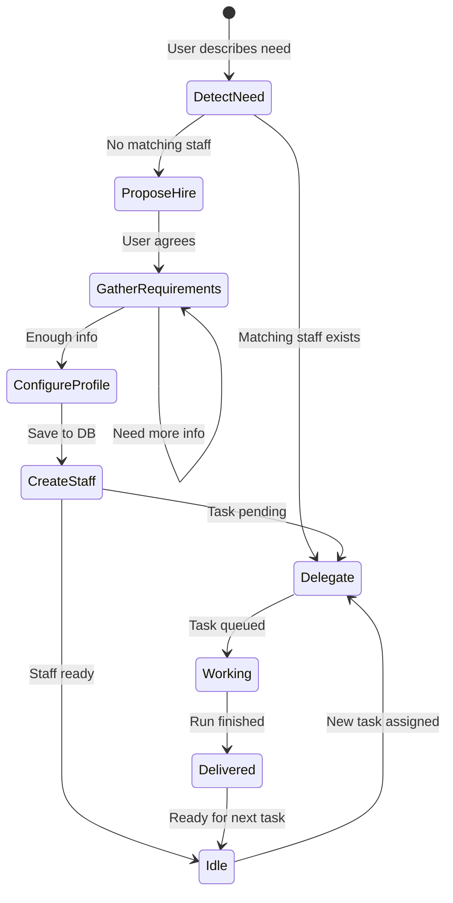
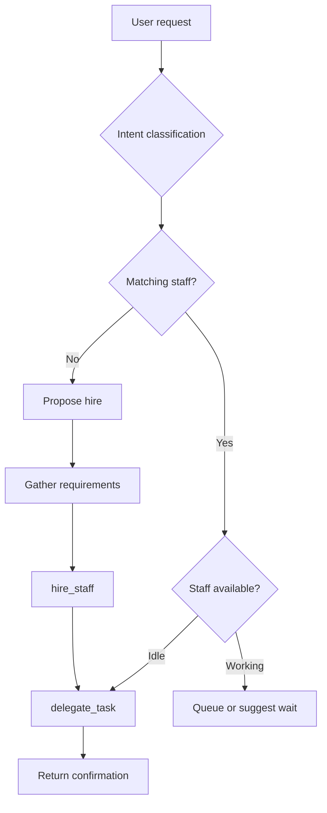

# Hệ thống Agent — Nex Staff

## Agent Types

| Type          | Role                    | Runtime                           | Persistent                         |
| ------------- | ----------------------- | --------------------------------- | ---------------------------------- |
| **Assistant** | Coordinator, gatekeeper | `ToolLoopAgent` (sync, streaming) | 1 per user, auto-created on signup |
| **Staff**     | Specialist worker       | `DurableAgent` + Workflow (async) | N per user, hired on demand        |

### Assistant

- Cửa ngõ duy nhất giữa user và hệ thống
- Biết toàn bộ staff roster, documents, task history
- Quyết định: tự xử lý, delegate, hoặc đề xuất hire
- Không thực hiện công việc nặng — delegate cho Staff

### Staff

- Chuyên gia theo role (Writer, Researcher, Analyst...)
- Làm việc async trong background workflow
- Có instructions, skills, tools, document access riêng
- Một staff có thể nhận nhiều tasks (queue khi đang busy)

---

## Hiring Flow



### Chi tiết từng bước

**1. DetectNeed**

- User mô tả nhu cầu: "tôi cần viết blog", "research thị trường X"
- Assistant phân loại intent: `write`, `research`, `analyze`, `code`, `marketing`

**2. ProposeHire** (khi không có staff phù hợp)

- Assistant đề xuất role cụ thể: "Bạn cần hire Content Writer không?"
- Giải thích ngắn staff sẽ làm gì

**3. GatherRequirements**

- Assistant hỏi qua chat (không form):
  - Tone/style (casual, formal, technical)
  - Target audience
  - Tài liệu tham khảo cần link
  - Constraints đặc biệt

**4. ConfigureProfile**

- Assistant map requirements → staff profile
- Chọn preset template hoặc custom
- Set `useSandbox` based on role

**5. CreateStaff**

- `hire_staff` tool lưu vào DB
- Assign 8-bit avatar sprite
- Notify user: "Alex (Content Writer) đã join team!"

**6. Delegate** (nếu có task pending)

- Ngay sau hire, delegate task ban đầu nếu user đã mô tả

---

## Staff Profile

```typescript
interface StaffProfile {
  id: string;
  userId: string;
  name: string; // "Alex" — tên hiển thị
  role: string; // "Content Writer"
  avatar: string; // 8-bit sprite ID
  model?: string; // Override model, default gateway default
  instructions: string; // System prompt / job description
  skills: Skill[]; // AI SDK skills (markdown)
  tools: ToolDef[]; // Tool definitions (JSON schema)
  useSandbox: boolean; // true = Vercel Sandbox per task
  documents: string[]; // Linked document IDs
  status: "idle" | "working" | "offline";
  hiredAt: Date;
}

interface Skill {
  name: string;
  description: string;
  content: string; // Markdown skill content
}

interface ToolDef {
  name: string;
  description: string;
  inputSchema: object; // JSON Schema
  handler: "http" | "rag" | "sandbox_bash" | "sandbox_file";
  config?: object; // Handler-specific config
}
```

### Preset Templates

| Template     | Role                 | useSandbox | Default Skills                        |
| ------------ | -------------------- | ---------- | ------------------------------------- |
| `writer`     | Content Writer       | false      | Blog writing, SEO, tone adaptation    |
| `researcher` | Researcher           | false      | Web research, summarization, citation |
| `analyst`    | Data Analyst         | true       | CSV analysis, chart generation        |
| `reviewer`   | Code Reviewer        | true       | Code review, security check           |
| `social`     | Social Media Manager | false      | Post drafting, hashtag research       |

---

## Delegation Logic

Assistant quyết định delegate theo thứ tự:



### 1. Intent Classification

Phân loại yêu cầu user:

| Intent      | Keywords / signals             | Preferred role       |
| ----------- | ------------------------------ | -------------------- |
| `write`     | viết, blog, content, bài       | Content Writer       |
| `research`  | research, tìm hiểu, thị trường | Researcher           |
| `analyze`   | phân tích, data, số liệu       | Data Analyst         |
| `code`      | code, review, bug, PR          | Code Reviewer        |
| `marketing` | social, post, campaign         | Social Media Manager |

### 2. Staff Matching

So khớp `staff.role` + `staff.skills` với intent:

- Exact role match → highest priority
- Skill overlap → secondary
- Generalist staff (nếu có) → fallback

### 3. Availability

| Status    | Behavior                                    |
| --------- | ------------------------------------------- |
| `idle`    | Delegate immediately                        |
| `working` | Queue task hoặc hỏi user có muốn chờ        |
| `offline` | Không delegate; thông báo staff unavailable |

### 4. Fallback

Không match → đề xuất hire với role phù hợp nhất.

---

## Skills & Tools Model

### Skills

Skills là markdown documents mô tả domain knowledge và workflow.

**Inline trong DurableAgent:**

```typescript
const agent = new DurableAgent({
  system: staff.instructions,
  skills: [
    {
      name: "blog-writing",
      description: "Write SEO-optimized blog posts",
      content: readFileSync("./templates/skills/blog-writing.md", "utf-8"),
    },
  ],
});
```

**Provider upload (optional, Phase 2+):**

```typescript
const { providerReference } = await uploadSkill({
  api: anthropic.skills(),
  files: [{ path: "SKILL.md", content: skillMarkdown }],
  displayTitle: "Blog Writing",
});
```

### Tools

**Assistant tools** (platform-level, code-defined):

| Tool                | Scope                |
| ------------------- | -------------------- |
| `hire_staff`        | Create staff in DB   |
| `delegate_task`     | Start workflow       |
| `search_documents`  | RAG across user docs |
| `web_research`      | Internet search      |
| `list_staff`        | Roster query         |
| `check_task_status` | Task poll            |
| `get_deliverable`   | Fetch result         |

**Staff tools** (per-staff, from DB + sandbox):

| Handler        | Mô tả                  | Requires sandbox |
| -------------- | ---------------------- | ---------------- |
| `rag`          | Query linked documents | No               |
| `http`         | Templated HTTP call    | No               |
| `sandbox_bash` | Run shell command      | Yes              |
| `sandbox_file` | Read/write file        | Yes              |

**Sandbox tool example:**

```typescript
function buildSandboxTools(sandbox: SandboxSession) {
  return {
    run_command: tool({
      description: "Run a shell command in the workspace",
      inputSchema: z.object({ command: z.string() }),
      execute: async ({ command }) => {
        const result = await sandbox.runCommand(command);
        return { stdout: result.stdout, stderr: result.stderr };
      },
    }),
    read_file: tool({
      description: "Read a file from the workspace",
      inputSchema: z.object({ path: z.string() }),
      execute: async ({ path }) => {
        return await sandbox.readFile(path);
      },
    }),
    write_file: tool({
      description: "Write content to a file",
      inputSchema: z.object({ path: z.string(), content: z.string() }),
      execute: async ({ path, content }) => {
        await sandbox.writeFile(path, content);
        return { success: true };
      },
    }),
  };
}
```

### Documents (RAG)

User documents → chunked → embedded → pgvector.

Staff access documents qua:

1. `documents` array trong staff profile (linked doc IDs)
2. `search_documents` tool trong staff toolset (scoped to linked docs)

---

## Task Lifecycle

```
pending → running → completed | failed | cancelled
```

| Status      | Mô tả                                       | Trigger                                |
| ----------- | ------------------------------------------- | -------------------------------------- |
| `pending`   | Task created, workflow chưa start           | `delegate_task` insert                 |
| `running`   | `workflow_run_id` assigned, agent executing | `start()` returns                      |
| `completed` | Deliverable saved                           | Workflow step `saveDeliverable`        |
| `failed`    | Error logged                                | Workflow error / agent `status: error` |
| `cancelled` | User cancelled                              | `POST /api/tasks/[id]/cancel`          |

### Retry Policy

- `failed` tasks: Assistant có thể đề xuất retry
- Retry = tạo task mới với cùng brief (không reuse workflow run)
- Max 3 retries per original task (tracked via `metadata.retryCount`)

### Notifications

| Event            | Channel            | Payload                              |
| ---------------- | ------------------ | ------------------------------------ |
| `task.started`   | SSE                | `{ taskId, staffName }`              |
| `task.completed` | SSE + chat message | `{ taskId, deliverableId, preview }` |
| `task.failed`    | SSE + chat message | `{ taskId, error }`                  |
| `staff.hired`    | SSE                | `{ staffId, name, role }`            |

---

## Assistant Instructions (template)

```markdown
You are the Assistant for Nex Staff — the user's personal coordinator.

Your responsibilities:

1. Understand the user's project and goals through conversation
2. Manage company documents (upload, search, organize)
3. Hire specialized staff when needed
4. Delegate tasks to the right staff member
5. Keep the user informed about task progress

When delegating:

- Always confirm which staff member received the task
- Tell the user they can continue chatting
- Never wait for task completion in your response

When hiring:

- Ask clarifying questions about role, tone, and requirements
- Suggest appropriate preset templates
- Introduce the new staff member by name

You have access to the user's staff roster and documents. Use tools proactively.
```

---

## Tài liệu liên quan

- [ARCHITECTURE.md](ARCHITECTURE.md) — Runtime implementation
- [DATA-MODEL.md](DATA-MODEL.md) — Database tables
- [API.md](API.md) — Tool schemas, endpoints
