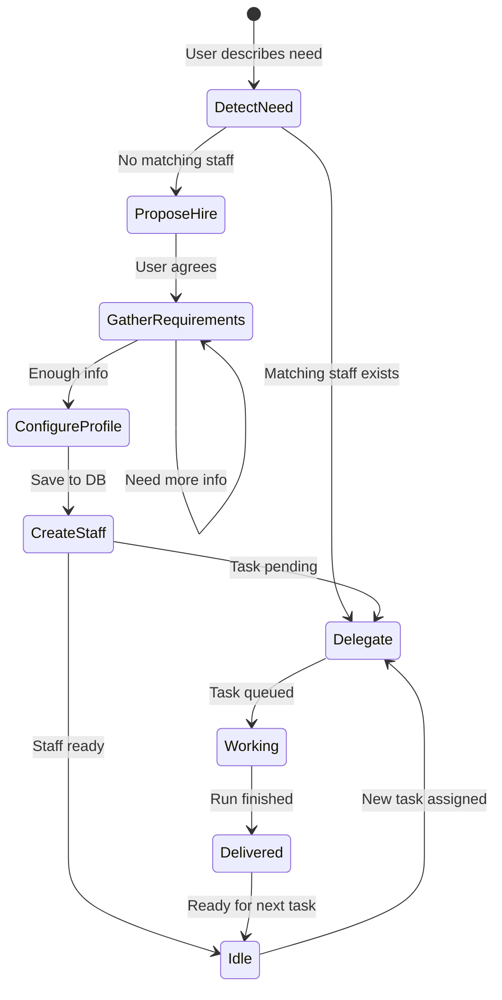
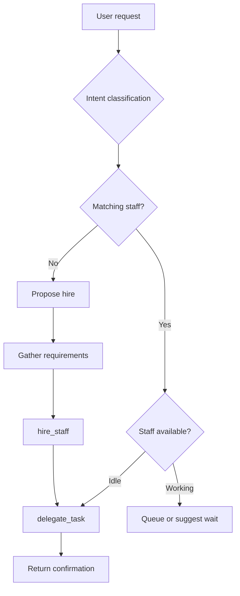
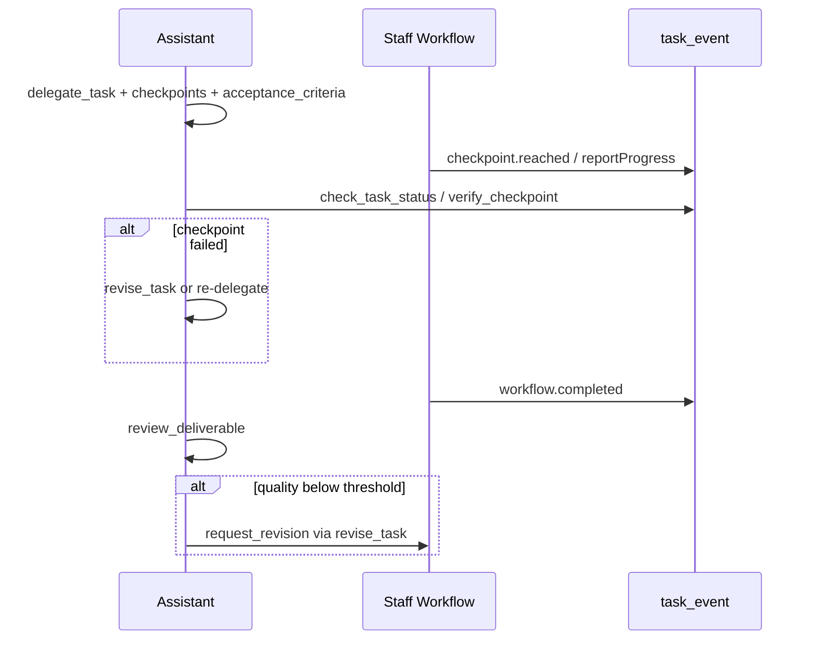
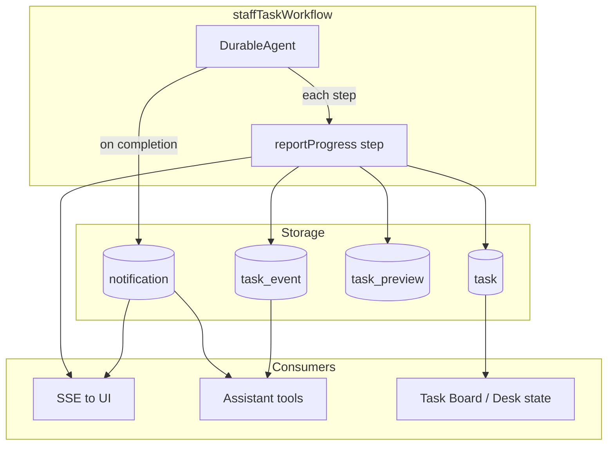
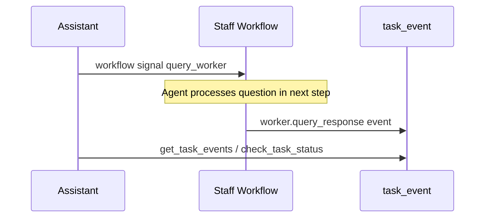

# Agent System — Nex Staff

## Agent Types

| Type          | Role                    | Runtime                           | Persistent                         |
| ------------- | ----------------------- | --------------------------------- | ---------------------------------- |
| **Assistant** | Coordinator, gatekeeper | `ToolLoopAgent` (sync, streaming) | 1 per user, auto-created on signup |
| **Staff**     | Specialist worker       | `DurableAgent` + Workflow (async) | N per user, hired on demand        |

### Assistant

- Sole gateway between the Boss and the system
- Knows the full staff roster, Documents, and task history
- Decides: handle directly, Delegate, or propose Hire
- Does not perform heavy work — Delegates to Staff

### Staff

- Specialist by role (Writer, Researcher, Analyst...)
- Works async in a background workflow
- Has its own instructions, skills, tools, and document access
- A Staff member can take multiple tasks (queued when busy)

---

## Hiring Flow



### Step-by-step details

**1. DetectNeed**

- Boss describes a need: "I need to write a blog", "research market X"
- Assistant classifies intent: `write`, `research`, `analyze`, `code`, `marketing`

**2. ProposeHire** (when no matching Staff exists)

- Assistant proposes a specific role: "Do you want to Hire a Content Writer?"
- Briefly explains what the Staff member will do

**3. GatherRequirements**

- Assistant asks via chat (no form):
  - Tone/style (casual, formal, technical)
  - Target audience
  - Reference Documents to link
  - Special constraints

**4. ConfigureProfile**

- Assistant maps requirements → staff profile
- Chooses preset template or custom
- Set `useSandbox` based on role

**5. CreateStaff**

- `hire_staff` tool saves to DB
- Assign 8-bit avatar sprite
- Notify Boss: "Alex (Content Writer) has joined the team!"

**6. Delegate** (if a task is pending)

- Right after Hire, Delegate the initial task if the Boss already described it

---

## Staff Profile

```typescript
interface StaffProfile {
  id: string;
  userId: string;
  name: string; // "Alex" — display name
  role: string; // "Content Writer"
  avatar: string; // 8-bit sprite ID
  model?: string; // Override model, default gateway default
  instructions: string; // System prompt / job description
  skills: Skill[]; // AI SDK skills (markdown)
  tools: ToolDef[]; // Tool definitions (JSON schema)
  useSandbox: boolean; // true = Vercel Sandbox per task
  documents: string[]; // Linked document IDs
  status: "idle" | "working" | "offline";
  hiredAt: Date;
}

interface Skill {
  name: string;
  description: string;
  content: string; // Markdown skill content
}

interface ToolDef {
  name: string;
  description: string;
  inputSchema: object; // JSON Schema
  handler: "http" | "rag" | "sandbox_bash" | "sandbox_file";
  config?: object; // Handler-specific config
}
```

### Preset Templates

| Template     | Role                 | useSandbox | Default Skills                        |
| ------------ | -------------------- | ---------- | ------------------------------------- |
| `writer`     | Content Writer       | **true** (MVP) | Blog writing, file draft, tone adaptation |
| `researcher` | Researcher           | false      | Web research, summarization, citation |
| `analyst`    | Data Analyst         | true       | CSV analysis, chart generation        |
| `reviewer`   | Code Reviewer        | true       | Code review, security check           |
| `social`     | Social Media Manager | false      | Post drafting, hashtag research       |

> **MVP:** Only ship the `writer` template with `useSandbox: true` — seed Documents from Archive Room, write Deliverable in sandbox.

---

## Delegation Logic

The Assistant decides whether to Delegate in this order:



### 1. Intent Classification

Classify the Boss's request:

| Intent      | Keywords / signals             | Preferred role       |
| ----------- | ------------------------------ | -------------------- |
| `write`     | write, blog, content, article  | Content Writer       |
| `research`  | research, learn about, market  | Researcher           |
| `analyze`   | analyze, data, metrics         | Data Analyst         |
| `code`      | code, review, bug, PR          | Code Reviewer        |
| `marketing` | social, post, campaign         | Social Media Manager |

### 2. Staff Matching

Match `staff.role` + `staff.skills` to intent:

- Exact role match → highest priority
- Skill overlap → secondary
- Generalist staff (if any) → fallback

### 3. Availability

| Status    | Behavior                                    |
| --------- | ------------------------------------------- |
| `idle`    | Delegate immediately                        |
| `working` | Queue task or ask the Boss if they want to wait |
| `offline` | Do not Delegate; notify that Staff is unavailable |

### 4. Fallback

No match → propose Hire with the best-fit role.

---

## Supervision & Multi-worker Control

The Assistant does not only **Delegate** but also **supervises** workers: checks checkpoints, reviews Deliverables, and coordinates multiple workers in parallel.

### Hub-and-spoke (existing)

| Component | Function |
|-----------|-----------|
| 1 Assistant per user | Sole coordinator — the Boss does not talk directly to workers |
| N Staff per user | Specialist workers run async in separate workflows |
| `delegate_task` | Fire-and-forget — multiple Staff run **in parallel** |
| `list_active_tasks` | Assistant sees all tasks running at once |
| `list_staff` | Roster + idle/working status |
| Notification queue | Assistant knows when a task finishes to notify the Boss |
| Retry policy (max 3) | Handles worker failures |

### Task queue semantics

When Staff is `working`, new tasks are **queued** instead of rejected.

| Rule | Value |
|------|---------|
| Queue order | **FIFO** per staff |
| Concurrency per staff | **1 running** + up to **3 pending** (default) |
| Cross-staff parallelism | **Unlimited** (bounded by Vercel Workflow concurrency) |
| Queue full | Assistant notifies the Boss; suggests another Staff member or waiting |

Assistant tool **`list_queued_tasks`** — backlog per staff (pending tasks that have not started a workflow).

### Supervisor Loop

The Assistant verifies workers **throughout the task lifecycle**, not only on completion:



**When Delegating**, the Assistant (or pre-processing) sets:

- `metadata.acceptanceCriteria` — short rubric for `review_deliverable` to score output
- `checkpoints[]` — planned milestones (see § Task Checkpoints)

**Assistant supervision tools:**

| Tool | Purpose |
|------|---------|
| `verify_checkpoint` | Compare checkpoint status vs plan; return pass/fail + evidence |
| `review_deliverable` | LLM scores Deliverable vs `acceptanceCriteria` |
| `revise_task` | Send feedback to worker (workflow signal) or spawn a new task |
| `list_queued_tasks` | View pending backlog per staff |

Tool schema details: [API.md](API.md).

### Multi-task orchestration

When a Boss request needs **multiple workers**:

1. Assistant **decomposes** the brief → creates `task_group` (`metadata.parentGroupId`)
2. Delegate in parallel (e.g. Researcher + Writer) or sequentially with dependencies
3. Dependent tasks: `metadata.dependsOn: [taskId]` — workflow starts only when dependency is `completed` **and** Assistant `verify_checkpoint` passes
4. Assistant uses `list_active_tasks` + filter `parentGroupId` to report overall progress to the Boss

Example: "Research market X then write a blog"

```
Group: blog-about-market-X
├── Task 1: Researcher — research + citations     (no deps)
└── Task 2: Writer — write blog                   (dependsOn: Task 1)
```

Assistant behavior:
- Start Task 1 immediately
- Poll Task 1 checkpoints; when research is verified → start Task 2
- Report group progress to the Boss: "Research 100%, Writer drafting 30%"

### Assistant behavior — supervision

```markdown
When delegating multi-step work:
- Decompose into task_group with explicit dependencies
- Set acceptanceCriteria on each task brief
- Define checkpoints before starting workflow

While tasks run:
- Periodically check list_active_tasks (especially on user message)
- verify_checkpoint when worker reports checkpoint.reached
- If checkpoint failed, use revise_task with specific feedback

When task completes:
- Always run review_deliverable before notifying user
- If score below threshold, offer revision (revise_task) before presenting to user
```

---

## Skills & Tools Model

### Skills

Skills are markdown Documents describing domain knowledge and workflow.

**Inline in DurableAgent:**

```typescript
const agent = new DurableAgent({
  system: staff.instructions,
  skills: [
    {
      name: "blog-writing",
      description: "Write SEO-optimized blog posts",
      content: readFileSync("./templates/skills/blog-writing.md", "utf-8"),
    },
  ],
});
```

**Provider upload (optional, Phase 2+):**

```typescript
const { providerReference } = await uploadSkill({
  api: anthropic.skills(),
  files: [{ path: "SKILL.md", content: skillMarkdown }],
  displayTitle: "Blog Writing",
});
```

### Tools

**Assistant tools** (platform-level, code-defined):

| Tool                | Scope                |
| ------------------- | -------------------- |
| `hire_staff`        | Create staff in DB   |
| `delegate_task`     | Start workflow       |
| `search_documents`  | RAG across user docs |
| `web_research`      | Internet search      |
| `list_staff`        | Roster query                                       |
| `check_task_status` | Status + progress + interim result for a task      |
| `list_active_tasks` | Running tasks + recently completed, not yet notified |
| `get_task_events`   | Detailed step-by-step log                          |
| `get_task_preview`  | Temporary draft output                             |
| `get_deliverable`   | Fetch result                                       |
| `verify_checkpoint` | Verify planned checkpoint vs evidence              |
| `review_deliverable`| Score Deliverable vs acceptanceCriteria            |
| `revise_task`       | Send feedback / spawn revision task                |
| `list_queued_tasks` | Pending backlog per staff                          |

**Staff tools** (per-staff, from DB + sandbox):

| Handler        | Description            | Requires sandbox |
| -------------- | ---------------------- | ---------------- |
| `rag`          | Query linked documents | No               |
| `http`         | Templated HTTP call    | No               |
| `sandbox_bash` | Run shell command      | Yes              |
| `sandbox_file` | Read/write file        | Yes              |

**Sandbox tool example:**

```typescript
function buildSandboxTools(sandbox: SandboxSession) {
  return {
    run_command: tool({
      description: "Run a shell command in the workspace",
      inputSchema: z.object({ command: z.string() }),
      execute: async ({ command }) => {
        const result = await sandbox.runCommand(command);
        return { stdout: result.stdout, stderr: result.stderr };
      },
    }),
    read_file: tool({
      description: "Read a file from the workspace",
      inputSchema: z.object({ path: z.string() }),
      execute: async ({ path }) => {
        return await sandbox.readFile(path);
      },
    }),
    write_file: tool({
      description: "Write content to a file",
      inputSchema: z.object({ path: z.string(), content: z.string() }),
      execute: async ({ path, content }) => {
        await sandbox.writeFile(path, content);
        return { success: true };
      },
    }),
  };
}
```

### Documents (RAG)

Boss Documents → chunked → embedded → pgvector.

Staff access Documents via:

1. `documents` array in staff profile (linked doc IDs)
2. `search_documents` tool in staff toolset (scoped to linked docs)

---

## Task Observability — Progress tracking & notifications

After `delegate_task`, the Assistant **does not block** but can (and should) know how far Staff has progressed, current status, interim results, and **when finished** to notify the Boss.

### Problems to solve

| Need | Who needs it | How it's addressed |
|------|--------------|-------------------|
| Is the task running or done? | Assistant + Boss | `task.status` + SSE |
| Which step is it on? | Assistant + Boss | `task_event` log + `currentStep` |
| Any interim result yet? | Assistant + Boss | `task_preview` + `agent.text_delta` events |
| When done to notify Boss? | Assistant | `notification` queue + SSE `task.completed` |
| Boss asks "How far is Alex?" | Assistant | Tool `check_task_status` / `get_task_events` |

### Architecture overview



### Task Event Log (`task_event`)

Append-only log — each step in the workflow/agent writes one event.

| Event type | When | Example payload |
|------------|------|-----------------|
| `workflow.started` | Workflow starts | `{ workflowRunId }` |
| `sandbox.created` | Sandbox spin-up complete | `{ durationMs }` |
| `agent.step_started` | DurableAgent starts step N | `{ step, maxSteps, label }` |
| `agent.tool_called` | Staff calls tool | `{ toolName, inputSummary }` |
| `agent.tool_result` | Tool returns | `{ toolName, resultSummary }` |
| `agent.text_delta` | Interim text output | `{ chunk }` — append to preview |
| `agent.step_completed` | Step ends | `{ step, durationMs }` |
| `checkpoint.reached` | Worker reports milestone reached | `{ checkpointId, label, evidence }` |
| `checkpoint.verified` | Assistant verify pass | `{ checkpointId, score, reasoning }` |
| `checkpoint.failed` | Worker or verify fail | `{ checkpointId, reason }` |
| `worker.query_response` | Phase 2: answer to query_worker | `{ question, answer }` |
| `deliverable.saved` | Final result saved | `{ deliverableId, title }` |
| `workflow.completed` | Success | `{ deliverableId }` |
| `workflow.failed` | Error | `{ error, step }` |

```typescript
interface TaskEvent {
  id: string;
  taskId: string;
  type: TaskEventType;
  payload: Record<string, unknown>;
  createdAt: Date;
}
```

### Progress on `task` (denormalized)

Updated whenever an important event occurs — Assistant reads quickly without scanning all events.

```typescript
interface TaskProgress {
  status: "pending" | "running" | "completed" | "failed" | "cancelled";
  progressPercent: number;      // 0-100, estimated from step/maxSteps
  currentStep: string;          // "Researching on the web..."
  lastEventAt: Date;
  lastEventType: TaskEventType;
  workflowRunId: string;
}
```

**`progressPercent` formula:** `Math.round((currentStep / maxSteps) * 100)` — cap at 95% until `workflow.completed`.

### Workflow — writing progress

```typescript
// lib/workflows/staff-task.ts
export async function staffTaskWorkflow(taskId: string) {
  "use workflow";

  await reportProgress(taskId, {
    type: "workflow.started",
    label: "Starting work",
    progressPercent: 0,
  });

  const task = await loadTask(taskId);
  const staff = await loadStaff(task.staffId);

  if (staff.useSandbox) {
    await reportProgress(taskId, { type: "sandbox.creating", label: "Preparing Workspace..." });
    const sandbox = await createStaffSandbox(staff, task);
    await reportProgress(taskId, { type: "sandbox.created", label: "Workspace ready" });
  }

  const agent = new DurableAgent({ /* ... */ });

  const result = await agent.stream({
    messages: [{ role: "user", content: task.brief }],
    maxSteps: 20,
    onStepFinish: async ({ step, toolCalls, text }) => {
      await reportProgress(taskId, {
        type: "agent.step_completed",
        label: summarizeStep(toolCalls, text),
        progressPercent: Math.round((step / 20) * 90),
        payload: { step, toolNames: toolCalls?.map(t => t.toolName) },
      });
      if (text) await appendTaskPreview(taskId, text);
    },
  });

  const deliverableId = await saveDeliverable(taskId, result);
  await reportProgress(taskId, {
    type: "workflow.completed",
    label: "Complete",
    progressPercent: 100,
    payload: { deliverableId },
  });

  await enqueueNotification(taskId, "task.completed");
}

async function reportProgress(taskId: string, event: ProgressInput) {
  "use step";
  await db.insert(taskEvents).values({ taskId, type: event.type, payload: event });
  await db.update(tasks).set({
    currentStep: event.label,
    progressPercent: event.progressPercent,
    lastEventAt: new Date(),
    lastEventType: event.type,
    status: event.type === "workflow.completed" ? "completed"
          : event.type === "workflow.failed" ? "failed"
          : "running",
  }).where(eq(tasks.id, taskId));
  await publishTaskSSE(taskId, event);
}
```

### Assistant Tools — observability

#### `check_task_status`

Returns a full snapshot for the Assistant to answer the Boss.

```typescript
// Response example
{
  taskId: "uuid",
  staffName: "Alex",
  staffRole: "Content Writer",
  status: "running",
  progressPercent: 45,
  currentStep: "Writing the introduction...",
  startedAt: "2026-07-04T10:05:00Z",
  lastEventAt: "2026-07-04T10:08:30Z",
  recentEvents: [
    { type: "agent.tool_called", label: "web_research", at: "..." },
    { type: "agent.step_completed", label: "Research complete", at: "..." },
  ],
  hasPreview: true,
  previewExcerpt: "AI agents are transforming how solo founders..."
}
```

#### `list_active_tasks`

All non-terminal tasks (`pending`, `running`) + `completed` tasks in the last hour not yet notified.

```typescript
{
  active: [
    { taskId, staffName, status, progressPercent, currentStep },
  ],
  recentlyCompleted: [
    { taskId, staffName, deliverableId, completedAt },
  ],
}
```

Assistant uses this when the Boss asks generally: "What is everyone working on?"

#### `get_task_events`

Full event log (paginated) — when the Boss wants details.

#### `get_task_preview`

Temporary draft output — Staff has generated text but not yet finalized the Deliverable.

### Notification — Assistant knows when a task finishes

Two parallel channels: **push for UI** and **queue for Assistant**.


**`notification` table:**

```typescript
interface Notification {
  id: string;
  userId: string;
  type: "task.completed" | "task.failed" | "staff.hired";
  taskId?: string;
  payload: Record<string, unknown>;
  status: "pending" | "delivered";  // delivered = Assistant has notified the Boss
  createdAt: Date;
  deliveredAt?: Date;
}
```

**Boss notification flow:**

1. Workflow completes → `notification` status `pending` + SSE `task.completed`
2. **Workspace UI** immediately: desk `done` state, `!` emote, Task Board updates
3. **Assistant proactive** (one of two):
   - **Option A (MVP):** When the Boss clicks Reception or sends another message, Assistant calls `list_active_tasks`, sees `recentlyCompleted` not yet `delivered` → cutscene dialogue
   - **Option B (Phase 2):** SSE triggers dialogue overlay automatically if the Boss is in the app
4. After Assistant notifies → `notification.status = delivered`

### Assistant behavior guidelines

```markdown
When a task is running:
- If user asks about progress, use check_task_status or list_active_tasks
- Summarize in plain language: "Alex is writing the introduction, about 45% done"
- Offer to show preview if hasPreview is true

When a task completes (pending notification):
- Proactively mention it at the start of the next interaction
- Trigger cutscene-style announcement with [View result] choice
- Mark notification as delivered after informing user

Never block waiting for tasks — always use tools to check current state.
```

### UI reflection

| UI element | Data source |
|------------|-------------|
| Desk `working` animation | `task.status === running` |
| Desk `done` + `!` emote | `task.status === completed` + notification pending |
| Task Board sticky note progress | `progressPercent`, `currentStep` |
| Task Board note preview text | `task_preview` excerpt |

### Polling vs Push

| Layer | Mechanism |
|-------|-----------|
| Workspace UI | SSE `task.progress`, `task.completed` — real-time |
| Assistant | Tools on-demand; `list_active_tasks` at conversation start |
| Workflow → DB | `reportProgress` step after each agent step |
| Fallback | `GET /api/tasks/[id]` if SSE disconnects |

---

## Task Checkpoints

**Planned** progress — the Assistant creates checkpoints when planning (in `delegate_task`), instead of only reacting to `agent.step_completed`.

### Comparison with step progress (existing)

| Mechanism | Who defines | When updated | Used for |
|-----------|-------------|--------------|----------|
| **Step progress** | Workflow (`maxSteps`) | Each `agent.step_completed` | Estimated UI progress bar |
| **Planned checkpoints** | Assistant when delegating | Worker reports `checkpoint.reached` → Assistant `verify_checkpoint` | Quality gate, meaningful milestones |

Both run in parallel; `progressPercent` prefers checkpoints when present (see formula below).

### When to create checkpoints

In `delegate_task`, the Assistant generates `checkpoints[]` from the brief:

```typescript
interface TaskCheckpoint {
  id: string;
  label: string;           // "Completed research from 3 sources"
  criteria: string;        // Short rubric for verify
  order: number;
  status: "pending" | "reached" | "verified" | "failed";
  reachedAt?: Date;
  verifiedAt?: Date;
  evidence?: string;       // excerpt from preview or tool output
}
```

**Example** brief "write a blog about AI agents":

| Order | Label | Criteria |
|-------|-------|----------|
| 1 | Research sources | ≥ 3 sources with citations |
| 2 | Outline | Outline with ≥ 4 sections |
| 3 | Draft | ≥ 800 words |
| 4 | Final deliverable | Saved to deliverable table |

### Worker checkpoint reporting

Staff workflow calls tool **`report_checkpoint`** (worker-side) or `reportProgress` with event type:

| Event | When |
|-------|------|
| `checkpoint.reached` | Worker marks milestone reached |
| `checkpoint.failed` | Worker did not reach it after N attempts |

Worker instructions template (append to staff system prompt):

```markdown
Before moving to the next phase of work:
1. Call report_checkpoint with checkpointId and evidence (quote from your output or tool results)
2. Wait for verification before proceeding to dependent checkpoints
3. If checkpoint fails, revise your approach based on feedback
```

### Assistant verify checkpoint

**`verify_checkpoint(checkpointId)`** — reads evidence + criteria, LLM judge pass/fail:

```typescript
// Response example
{
  checkpointId: "cp-1",
  status: "verified",  // or "failed"
  score: 8,
  reasoning: "Found 4 cited sources, meets ≥3 requirement",
  evidence: "Sources: [1] arxiv..., [2] blog..., ..."
}
```

Flow:
1. Worker → `checkpoint.reached` event
2. Assistant (proactive or on Boss ask) → `verify_checkpoint`
3. Pass → status `verified`; Fail → `revise_task` or notify Boss

### progressPercent — updated formula

When a task has checkpoints:

```
progressPercent = Math.round((verifiedCheckpoints / totalCheckpoints) * 100)
```

Cap at 95% until `workflow.completed` (preserves existing behavior).

When there are **no** checkpoints — fallback to the old formula:

```
progressPercent = Math.round((currentStep / maxSteps) * 90)
```

### Dynamic query — MVP vs Phase 2

| Mechanism | Phase | Description |
|-----------|-------|-------------|
| **DB polling** | MVP (Phase 1) | `check_task_status`, `get_task_events`, `get_task_preview` — Assistant reads DB state |
| **Workflow signal** `query_worker` | Phase 2 | Assistant sends question → worker workflow receives signal → responds via `task_event` type `worker.query_response` |

**Note:** MVP "dynamic query" = Assistant queries **DB**, not direct RPC to in-memory agent. Sufficient for most cases (progress, preview, events).

Phase 2 `query_worker` — when worker is stuck or needs clarification mid-task:



---

## Task Lifecycle

```
pending → running → completed | failed | cancelled
```

| Status      | Description                                 | Trigger                                |
| ----------- | ------------------------------------------- | -------------------------------------- |
| `pending`   | Task created, workflow not yet started      | `delegate_task` insert                 |
| `running`   | `workflow_run_id` assigned, agent executing | `start()` returns                      |
| `completed` | Deliverable saved                           | Workflow step `saveDeliverable`        |
| `failed`    | Error logged                                | Workflow error / agent `status: error` |
| `cancelled` | Boss cancelled                              | `POST /api/tasks/[id]/cancel`          |

### Retry Policy

- `failed` tasks: Assistant may propose retry
- Retry = create a new task with the same brief (do not reuse workflow run)
- Max 3 retries per original task (tracked via `metadata.retryCount`)

### Notifications

| Event            | Channel            | Payload                              |
| ---------------- | ------------------ | ------------------------------------ |
| `task.started`    | SSE                | `{ taskId, staffName }`                              |
| `task.progress`   | SSE                | `{ taskId, progressPercent, currentStep, preview? }` |
| `task.completed`  | SSE + notification | `{ taskId, deliverableId, preview }`                 |
| `task.failed`     | SSE + notification | `{ taskId, error }`                                  |
| `staff.hired`    | SSE                | `{ staffId, name, role }`            |

---

## Assistant Instructions (template)

```markdown
You are the Assistant for Nex Staff — the user's personal coordinator.

Your responsibilities:

1. Understand the user's project and goals through conversation
2. Manage company documents (upload, search, organize)
3. Hire specialized staff when needed
4. Delegate tasks to the right staff member
5. Keep the user informed about task progress
6. Verify checkpoints and review deliverables before presenting results to user

When delegating:

- Always confirm which staff member received the task
- Define checkpoints and acceptanceCriteria for non-trivial tasks
- Tell the user they can continue chatting
- Never wait for task completion in your response

When hiring:

- Ask clarifying questions about role, tone, and requirements
- Suggest appropriate preset templates
- Introduce the new staff member by name

You have access to the user's staff roster and documents. Use tools proactively.
```

---

## Related docs

- [ARCHITECTURE.md](ARCHITECTURE.md) — Runtime implementation
- [DATA-MODEL.md](DATA-MODEL.md) — Database tables
- [API.md](API.md) — Tool schemas, endpoints
- [EVAL-FRAMEWORK.md](EVAL-FRAMEWORK.md) — Worker quality metrics and tests
