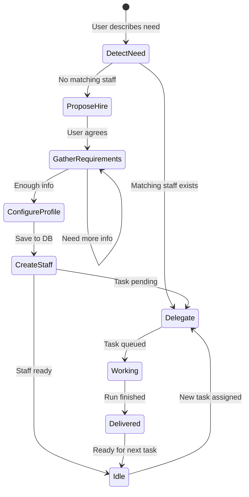
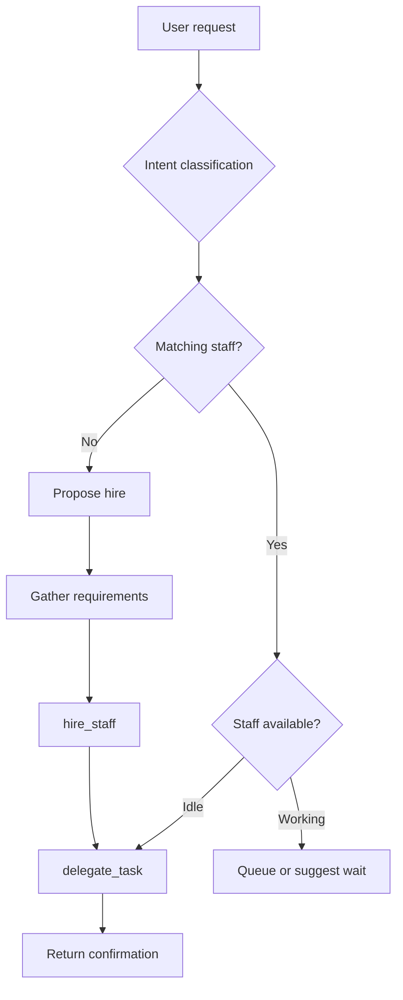
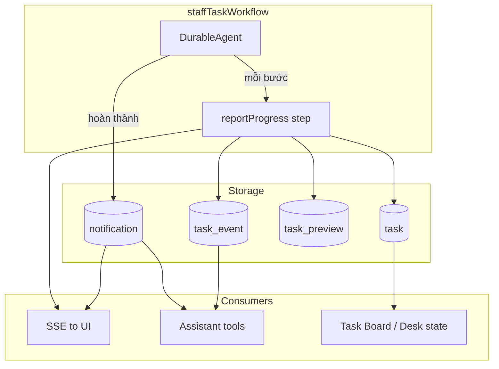
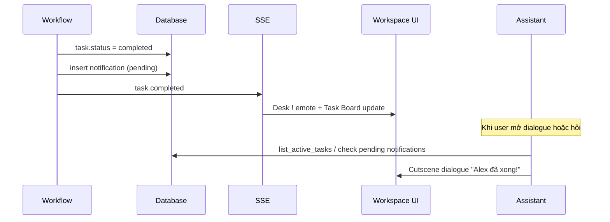

# Hệ thống Agent — Nex Staff

## Agent Types

| Type          | Role                    | Runtime                           | Persistent                         |
| ------------- | ----------------------- | --------------------------------- | ---------------------------------- |
| **Assistant** | Coordinator, gatekeeper | `ToolLoopAgent` (sync, streaming) | 1 per user, auto-created on signup |
| **Staff**     | Specialist worker       | `DurableAgent` + Workflow (async) | N per user, hired on demand        |

### Assistant

- Cửa ngõ duy nhất giữa user và hệ thống
- Biết toàn bộ staff roster, documents, task history
- Quyết định: tự xử lý, delegate, hoặc đề xuất hire
- Không thực hiện công việc nặng — delegate cho Staff

### Staff

- Chuyên gia theo role (Writer, Researcher, Analyst...)
- Làm việc async trong background workflow
- Có instructions, skills, tools, document access riêng
- Một staff có thể nhận nhiều tasks (queue khi đang busy)

---

## Hiring Flow



### Chi tiết từng bước

**1. DetectNeed**

- User mô tả nhu cầu: "tôi cần viết blog", "research thị trường X"
- Assistant phân loại intent: `write`, `research`, `analyze`, `code`, `marketing`

**2. ProposeHire** (khi không có staff phù hợp)

- Assistant đề xuất role cụ thể: "Bạn cần hire Content Writer không?"
- Giải thích ngắn staff sẽ làm gì

**3. GatherRequirements**

- Assistant hỏi qua chat (không form):
  - Tone/style (casual, formal, technical)
  - Target audience
  - Tài liệu tham khảo cần link
  - Constraints đặc biệt

**4. ConfigureProfile**

- Assistant map requirements → staff profile
- Chọn preset template hoặc custom
- Set `useSandbox` based on role

**5. CreateStaff**

- `hire_staff` tool lưu vào DB
- Assign 8-bit avatar sprite
- Notify user: "Alex (Content Writer) đã join team!"

**6. Delegate** (nếu có task pending)

- Ngay sau hire, delegate task ban đầu nếu user đã mô tả

---

## Staff Profile

```typescript
interface StaffProfile {
  id: string;
  userId: string;
  name: string; // "Alex" — tên hiển thị
  role: string; // "Content Writer"
  avatar: string; // 8-bit sprite ID
  model?: string; // Override model, default gateway default
  instructions: string; // System prompt / job description
  skills: Skill[]; // AI SDK skills (markdown)
  tools: ToolDef[]; // Tool definitions (JSON schema)
  useSandbox: boolean; // true = Vercel Sandbox per task
  documents: string[]; // Linked document IDs
  status: "idle" | "working" | "offline";
  hiredAt: Date;
}

interface Skill {
  name: string;
  description: string;
  content: string; // Markdown skill content
}

interface ToolDef {
  name: string;
  description: string;
  inputSchema: object; // JSON Schema
  handler: "http" | "rag" | "sandbox_bash" | "sandbox_file";
  config?: object; // Handler-specific config
}
```

### Preset Templates

| Template     | Role                 | useSandbox | Default Skills                        |
| ------------ | -------------------- | ---------- | ------------------------------------- |
| `writer`     | Content Writer       | false      | Blog writing, SEO, tone adaptation    |
| `researcher` | Researcher           | false      | Web research, summarization, citation |
| `analyst`    | Data Analyst         | true       | CSV analysis, chart generation        |
| `reviewer`   | Code Reviewer        | true       | Code review, security check           |
| `social`     | Social Media Manager | false      | Post drafting, hashtag research       |

---

## Delegation Logic

Assistant quyết định delegate theo thứ tự:



### 1. Intent Classification

Phân loại yêu cầu user:

| Intent      | Keywords / signals             | Preferred role       |
| ----------- | ------------------------------ | -------------------- |
| `write`     | viết, blog, content, bài       | Content Writer       |
| `research`  | research, tìm hiểu, thị trường | Researcher           |
| `analyze`   | phân tích, data, số liệu       | Data Analyst         |
| `code`      | code, review, bug, PR          | Code Reviewer        |
| `marketing` | social, post, campaign         | Social Media Manager |

### 2. Staff Matching

So khớp `staff.role` + `staff.skills` với intent:

- Exact role match → highest priority
- Skill overlap → secondary
- Generalist staff (nếu có) → fallback

### 3. Availability

| Status    | Behavior                                    |
| --------- | ------------------------------------------- |
| `idle`    | Delegate immediately                        |
| `working` | Queue task hoặc hỏi user có muốn chờ        |
| `offline` | Không delegate; thông báo staff unavailable |

### 4. Fallback

Không match → đề xuất hire với role phù hợp nhất.

---

## Skills & Tools Model

### Skills

Skills là markdown documents mô tả domain knowledge và workflow.

**Inline trong DurableAgent:**

```typescript
const agent = new DurableAgent({
  system: staff.instructions,
  skills: [
    {
      name: "blog-writing",
      description: "Write SEO-optimized blog posts",
      content: readFileSync("./templates/skills/blog-writing.md", "utf-8"),
    },
  ],
});
```

**Provider upload (optional, Phase 2+):**

```typescript
const { providerReference } = await uploadSkill({
  api: anthropic.skills(),
  files: [{ path: "SKILL.md", content: skillMarkdown }],
  displayTitle: "Blog Writing",
});
```

### Tools

**Assistant tools** (platform-level, code-defined):

| Tool                | Scope                |
| ------------------- | -------------------- |
| `hire_staff`        | Create staff in DB   |
| `delegate_task`     | Start workflow       |
| `search_documents`  | RAG across user docs |
| `web_research`      | Internet search      |
| `list_staff`        | Roster query                                       |
| `check_task_status` | Trạng thái + tiến độ + kết quả tạm của một task   |
| `list_active_tasks` | Tasks đang chạy + vừa xong chưa thông báo        |
| `get_task_events`   | Nhật ký chi tiết từng bước                         |
| `get_task_preview`  | Draft output tạm thời                              |
| `get_deliverable`   | Fetch result                                       |

**Staff tools** (per-staff, from DB + sandbox):

| Handler        | Mô tả                  | Requires sandbox |
| -------------- | ---------------------- | ---------------- |
| `rag`          | Query linked documents | No               |
| `http`         | Templated HTTP call    | No               |
| `sandbox_bash` | Run shell command      | Yes              |
| `sandbox_file` | Read/write file        | Yes              |

**Sandbox tool example:**

```typescript
function buildSandboxTools(sandbox: SandboxSession) {
  return {
    run_command: tool({
      description: "Run a shell command in the workspace",
      inputSchema: z.object({ command: z.string() }),
      execute: async ({ command }) => {
        const result = await sandbox.runCommand(command);
        return { stdout: result.stdout, stderr: result.stderr };
      },
    }),
    read_file: tool({
      description: "Read a file from the workspace",
      inputSchema: z.object({ path: z.string() }),
      execute: async ({ path }) => {
        return await sandbox.readFile(path);
      },
    }),
    write_file: tool({
      description: "Write content to a file",
      inputSchema: z.object({ path: z.string(), content: z.string() }),
      execute: async ({ path, content }) => {
        await sandbox.writeFile(path, content);
        return { success: true };
      },
    }),
  };
}
```

### Documents (RAG)

User documents → chunked → embedded → pgvector.

Staff access documents qua:

1. `documents` array trong staff profile (linked doc IDs)
2. `search_documents` tool trong staff toolset (scoped to linked docs)

---

## Task Observability — Theo dõi tiến độ & thông báo

Sau khi `delegate_task`, Assistant **không block** nhưng vẫn có thể (và nên) biết staff đang làm đến đâu, trạng thái hiện tại, kết quả tạm, và **khi nào xong** để thông báo user.

### Vấn đề cần giải quyết

| Nhu cầu | Ai cần | Cách đáp ứng |
|---------|--------|--------------|
| Task đang chạy hay đã xong? | Assistant + User | `task.status` + SSE |
| Đang ở bước nào? | Assistant + User | `task_event` log + `currentStep` |
| Có kết quả tạm chưa? | Assistant + User | `task_preview` + events `agent.text_delta` |
| Khi nào xong để báo user? | Assistant | `notification` queue + SSE `task.completed` |
| User hỏi "Alex làm đến đâu?" | Assistant | Tool `check_task_status` / `get_task_events` |

### Kiến trúc tổng quan



### Task Event Log (`task_event`)

Append-only log — mỗi bước trong workflow/agent ghi một event.

| Event type | Khi nào | Payload ví dụ |
|------------|---------|---------------|
| `workflow.started` | Workflow bắt đầu | `{ workflowRunId }` |
| `sandbox.created` | Sandbox spin-up xong | `{ durationMs }` |
| `agent.step_started` | DurableAgent bắt đầu step N | `{ step, maxSteps, label }` |
| `agent.tool_called` | Staff gọi tool | `{ toolName, inputSummary }` |
| `agent.tool_result` | Tool trả về | `{ toolName, resultSummary }` |
| `agent.text_delta` | Có text output tạm | `{ chunk }` — append vào preview |
| `agent.step_completed` | Step kết thúc | `{ step, durationMs }` |
| `deliverable.saved` | Lưu kết quả cuối | `{ deliverableId, title }` |
| `workflow.completed` | Thành công | `{ deliverableId }` |
| `workflow.failed` | Lỗi | `{ error, step }` |

```typescript
interface TaskEvent {
  id: string;
  taskId: string;
  type: TaskEventType;
  payload: Record<string, unknown>;
  createdAt: Date;
}
```

### Progress trên `task` (denormalized)

Cập nhật mỗi khi có event quan trọng — Assistant đọc nhanh không cần scan toàn bộ events.

```typescript
interface TaskProgress {
  status: "pending" | "running" | "completed" | "failed" | "cancelled";
  progressPercent: number;      // 0-100, ước lượng từ step/maxSteps
  currentStep: string;          // "Đang research trên web..."
  lastEventAt: Date;
  lastEventType: TaskEventType;
  workflowRunId: string;
}
```

**Công thức `progressPercent`:** `Math.round((currentStep / maxSteps) * 100)` — cap 95% cho đến khi `workflow.completed`.

### Workflow — ghi progress

```typescript
// lib/workflows/staff-task.ts
export async function staffTaskWorkflow(taskId: string) {
  "use workflow";

  await reportProgress(taskId, {
    type: "workflow.started",
    label: "Bắt đầu công việc",
    progressPercent: 0,
  });

  const task = await loadTask(taskId);
  const staff = await loadStaff(task.staffId);

  if (staff.useSandbox) {
    await reportProgress(taskId, { type: "sandbox.creating", label: "Chuẩn bị workspace..." });
    const sandbox = await createStaffSandbox(staff, task);
    await reportProgress(taskId, { type: "sandbox.created", label: "Workspace sẵn sàng" });
  }

  const agent = new DurableAgent({ /* ... */ });

  const result = await agent.stream({
    messages: [{ role: "user", content: task.brief }],
    maxSteps: 20,
    onStepFinish: async ({ step, toolCalls, text }) => {
      await reportProgress(taskId, {
        type: "agent.step_completed",
        label: summarizeStep(toolCalls, text),
        progressPercent: Math.round((step / 20) * 90),
        payload: { step, toolNames: toolCalls?.map(t => t.toolName) },
      });
      if (text) await appendTaskPreview(taskId, text);
    },
  });

  const deliverableId = await saveDeliverable(taskId, result);
  await reportProgress(taskId, {
    type: "workflow.completed",
    label: "Hoàn thành",
    progressPercent: 100,
    payload: { deliverableId },
  });

  await enqueueNotification(taskId, "task.completed");
}

async function reportProgress(taskId: string, event: ProgressInput) {
  "use step";
  await db.insert(taskEvents).values({ taskId, type: event.type, payload: event });
  await db.update(tasks).set({
    currentStep: event.label,
    progressPercent: event.progressPercent,
    lastEventAt: new Date(),
    lastEventType: event.type,
    status: event.type === "workflow.completed" ? "completed"
          : event.type === "workflow.failed" ? "failed"
          : "running",
  }).where(eq(tasks.id, taskId));
  await publishTaskSSE(taskId, event);
}
```

### Assistant Tools — observability

#### `check_task_status`

Trả về snapshot đầy đủ cho Assistant trả lời user.

```typescript
// Response example
{
  taskId: "uuid",
  staffName: "Alex",
  staffRole: "Content Writer",
  status: "running",
  progressPercent: 45,
  currentStep: "Đang viết phần mở đầu...",
  startedAt: "2026-07-04T10:05:00Z",
  lastEventAt: "2026-07-04T10:08:30Z",
  recentEvents: [
    { type: "agent.tool_called", label: "web_research", at: "..." },
    { type: "agent.step_completed", label: "Research xong", at: "..." },
  ],
  hasPreview: true,
  previewExcerpt: "AI agents are transforming how solo founders..."
}
```

#### `list_active_tasks`

Tất cả tasks chưa terminal (`pending`, `running`) + tasks `completed` trong 1h chưa notify.

```typescript
{
  active: [
    { taskId, staffName, status, progressPercent, currentStep },
  ],
  recentlyCompleted: [
    { taskId, staffName, deliverableId, completedAt },
  ],
}
```

Assistant dùng khi user hỏi chung: "Mọi người đang làm gì?"

#### `get_task_events`

Full event log (paginated) — khi user muốn chi tiết.

#### `get_task_preview`

Draft output tạm thời — staff đã generate text nhưng chưa finalize deliverable.

### Notification — Assistant biết khi task xong

Hai kênh song song: **push cho UI** và **queue cho Assistant**.



**`notification` table:**

```typescript
interface Notification {
  id: string;
  userId: string;
  type: "task.completed" | "task.failed" | "staff.hired";
  taskId?: string;
  payload: Record<string, unknown>;
  status: "pending" | "delivered";  // delivered = Assistant đã báo user
  createdAt: Date;
  deliveredAt?: Date;
}
```

**Luồng thông báo user:**

1. Workflow xong → `notification` status `pending` + SSE `task.completed`
2. **Workspace UI** ngay lập tức: desk `done` state, `!` emote, Task Board cập nhật
3. **Assistant proactive** (một trong hai):
   - **Option A (MVP):** Khi user click Reception hoặc gửi message tiếp, Assistant gọi `list_active_tasks`, thấy `recentlyCompleted` chưa `delivered` → cutscene dialogue
   - **Option B (Phase 2):** SSE trigger dialogue overlay tự động nếu user đang trong app
4. Sau khi Assistant thông báo → `notification.status = delivered`

### Assistant behavior guidelines

```markdown
When a task is running:
- If user asks about progress, use check_task_status or list_active_tasks
- Summarize in plain language: "Alex đang viết phần mở đầu, khoảng 45% xong"
- Offer to show preview if hasPreview is true

When a task completes (pending notification):
- Proactively mention it at the start of the next interaction
- Trigger cutscene-style announcement with [Xem kết quả] choice
- Mark notification as delivered after informing user

Never block waiting for tasks — always use tools to check current state.
```

### UI reflection

| UI element | Data source |
|------------|-------------|
| Desk `working` animation | `task.status === running` |
| Desk `done` + `!` emote | `task.status === completed` + notification pending |
| Task Board sticky note progress | `progressPercent`, `currentStep` |
| Task Board note preview text | `task_preview` excerpt |

### Polling vs Push

| Layer | Mechanism |
|-------|-----------|
| Workspace UI | SSE `task.progress`, `task.completed` — real-time |
| Assistant | Tools on-demand; `list_active_tasks` at conversation start |
| Workflow → DB | `reportProgress` step sau mỗi agent step |
| Fallback | `GET /api/tasks/[id]` nếu SSE disconnect |

---

## Task Lifecycle

```
pending → running → completed | failed | cancelled
```

| Status      | Mô tả                                       | Trigger                                |
| ----------- | ------------------------------------------- | -------------------------------------- |
| `pending`   | Task created, workflow chưa start           | `delegate_task` insert                 |
| `running`   | `workflow_run_id` assigned, agent executing | `start()` returns                      |
| `completed` | Deliverable saved                           | Workflow step `saveDeliverable`        |
| `failed`    | Error logged                                | Workflow error / agent `status: error` |
| `cancelled` | User cancelled                              | `POST /api/tasks/[id]/cancel`          |

### Retry Policy

- `failed` tasks: Assistant có thể đề xuất retry
- Retry = tạo task mới với cùng brief (không reuse workflow run)
- Max 3 retries per original task (tracked via `metadata.retryCount`)

### Notifications

| Event            | Channel            | Payload                              |
| ---------------- | ------------------ | ------------------------------------ |
| `task.started`    | SSE                | `{ taskId, staffName }`                              |
| `task.progress`   | SSE                | `{ taskId, progressPercent, currentStep, preview? }` |
| `task.completed`  | SSE + notification | `{ taskId, deliverableId, preview }`                 |
| `task.failed`     | SSE + notification | `{ taskId, error }`                                  |
| `staff.hired`    | SSE                | `{ staffId, name, role }`            |

---

## Assistant Instructions (template)

```markdown
You are the Assistant for Nex Staff — the user's personal coordinator.

Your responsibilities:

1. Understand the user's project and goals through conversation
2. Manage company documents (upload, search, organize)
3. Hire specialized staff when needed
4. Delegate tasks to the right staff member
5. Keep the user informed about task progress

When delegating:

- Always confirm which staff member received the task
- Tell the user they can continue chatting
- Never wait for task completion in your response

When hiring:

- Ask clarifying questions about role, tone, and requirements
- Suggest appropriate preset templates
- Introduce the new staff member by name

You have access to the user's staff roster and documents. Use tools proactively.
```

---

## Tài liệu liên quan

- [ARCHITECTURE.md](ARCHITECTURE.md) — Runtime implementation
- [DATA-MODEL.md](DATA-MODEL.md) — Database tables
- [API.md](API.md) — Tool schemas, endpoints
