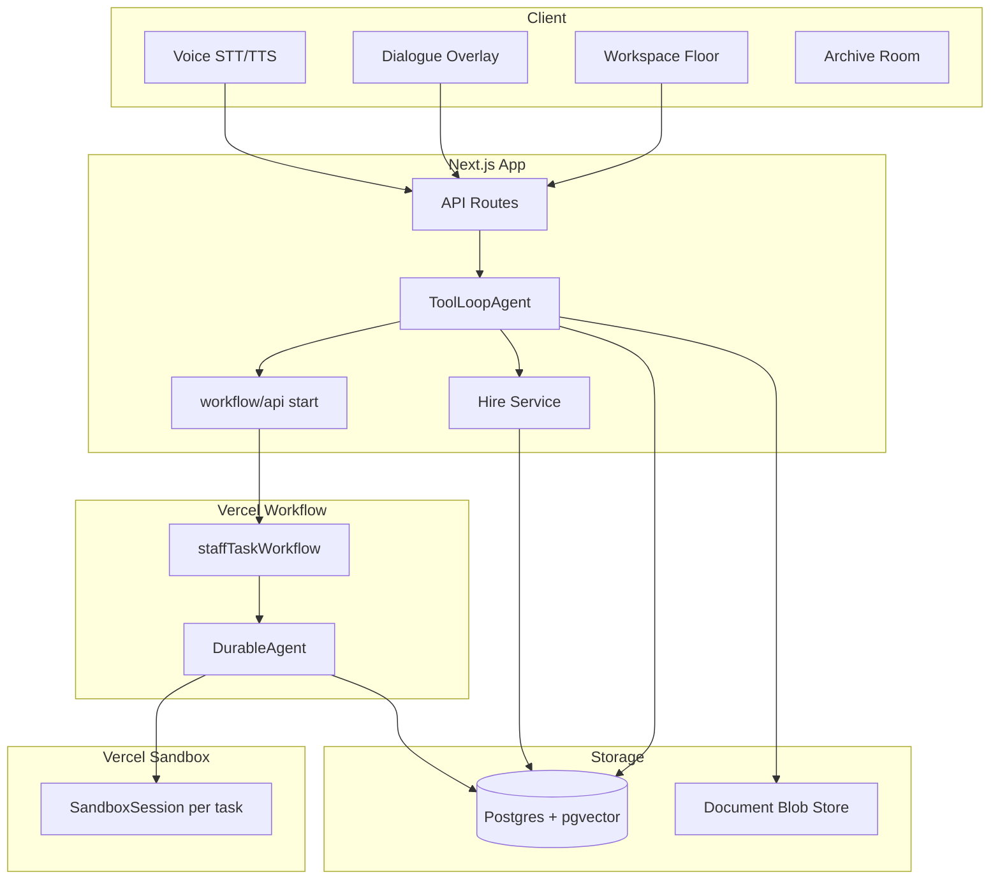
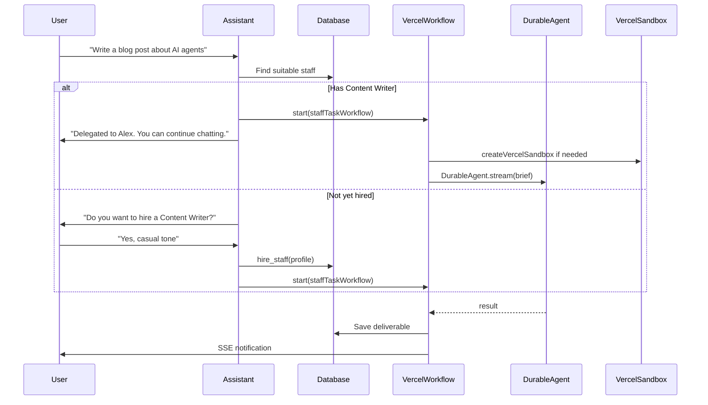

# Technical Architecture — Nex Staff

## Overview

Nex Staff is built directly on **AI SDK 7** — no Eve. Two main agent runtime layers:

1. **Assistant** (`ToolLoopAgent`) — sync, streaming, conversational
2. **Staff** — async, background, durable:
   - **Writer / sandbox staff:** `DurableAgent` + Vercel Workflow + Vercel Sandbox
   - **Coder staff:** Cursor SDK Cloud Agent (`@cursor/sdk`) on a configured GitHub repo

## Tech Stack

| Layer             | Technology                                            |
| ----------------- | ----------------------------------------------------- |
| Frontend          | Next.js 16 App Router, React 19, Tailwind CSS v4      |
| Agent framework   | AI SDK 7 (`ai`, `@ai-sdk/react`)                      |
| Assistant runtime | `ToolLoopAgent` + `streamText`                        |
| Staff runtime     | `DurableAgent` (`@workflow/ai`) or Cursor SDK Cloud (`@cursor/sdk`) |
| Sandbox           | `@ai-sdk/sandbox-vercel` — `createVercelSandbox()` (writer staff)     |
| Coder workspace   | GitHub repo (`CODER_GITHUB_REPO_URL`) + Cursor Cloud Agent            |
| Coder preview     | Cloudflare Pages deployment URL for the PR branch                     |
| Durability        | Vercel Workflow (`workflow`, `@ai-sdk/workflow`)      |
| Model provider    | Google Gemini (`@ai-sdk/google`)                |
| Voice (planned)   | Gemini / Google STT + TTS via `/api/voice/*`    |
| Database          | Neon Postgres + Drizzle ORM + pgvector                |
| Auth              | Better Auth (Google OAuth)                            |
| File storage      | Vercel Blob                                           |

> **Deferred (out of scope MVP):** Rate limiting / Upstash Redis — will be added after real usage data is available.

## Overall Architecture



## Agent Runtime Layers

### Layer 1 — Assistant (sync, streaming)

`ToolLoopAgent` handles all real-time interactions with the user.

**Responsibilities:**

- Chat streaming via `assistant.stream({ messages })` → `useChat` client
- Tools: hire, delegate, RAG, web research, list staff, check status
- Does not block on delegate — fire-and-forget via `start(staffTaskWorkflow)`

**Implementation pattern:**

```typescript
// lib/agents/assistant.ts
import { ToolLoopAgent } from "ai";
import { getGeminiModel } from "@/lib/ai/google";

export function createAssistant(userId: string) {
  return new ToolLoopAgent({
    model: getGeminiModel(),
    instructions: loadAssistantInstructions(userId),
    tools: {
      hire_staff: hireStaffTool,
      delegate_task: delegateTaskTool,
      search_documents: searchDocumentsTool,
      web_research: webResearchTool,
      list_staff: listStaffTool,
      check_task_status: checkTaskStatusTool,
      list_active_tasks: listActiveTasksTool,
      get_task_events: getTaskEventsTool,
      get_task_preview: getTaskPreviewTool,
      get_deliverable: getDeliverableTool,
    },
  });
}
```

**API route:**

```typescript
// app/api/chat/route.ts
export async function POST(req: Request) {
  const { messages } = await req.json();
  const user = await getServerViewer();
  const assistant = createAssistant(user.id);

  return assistant.stream({ messages });
}
```

### Layer 2 — Staff (async, durable)

Each delegated task = one Vercel Workflow run containing `DurableAgent`.

**Responsibilities:**

- Execute task brief with staff-specific instructions, skills, tools
- **Report progress** via `reportProgress` after each workflow/agent step
- Append draft text to `task_preview` when the agent streams
- Save deliverable; enqueue `notification` + SSE when complete

**Implementation pattern:**

```typescript
// lib/workflows/staff-task.ts
import { DurableAgent } from "@workflow/ai/agent";
import { createVercelSandbox } from "@ai-sdk/sandbox-vercel";

export async function staffTaskWorkflow(taskId: string) {
  "use workflow";

  const task = await loadTask(taskId);
  const staff = await loadStaff(task.staffId);

  let sandbox = null;
  if (staff.useSandbox) {
    sandbox = await createStaffSandbox(staff, task);
  }

  const agent = new DurableAgent({
    model: staff.model ?? "gemini-3.5-flash",
    system: staff.instructions,
    tools: buildStaffTools(staff, sandbox),
    skills: staff.skills,
  });

  const result = await agent.stream({
    messages: [{ role: "user", content: task.brief }],
    maxSteps: 20,
    onStepFinish: async ({ step, toolCalls, text }) => {
      await reportProgress(taskId, {
        type: "agent.step_completed",
        label: summarizeStep(toolCalls, text),
        progressPercent: Math.round((step / 20) * 90),
      });
      if (text) await appendTaskPreview(taskId, text);
    },
  });

  const deliverableId = await saveDeliverable(taskId, result);
  await reportProgress(taskId, {
    type: "workflow.completed",
    progressPercent: 100,
    payload: { deliverableId },
  });
  await enqueueNotification(taskId, "task.completed");
}

async function loadTask(taskId: string) {
  "use step";
  return db.query.tasks.findFirst({ where: eq(tasks.id, taskId) });
}

async function createStaffSandbox(staff: Staff, task: Task) {
  "use step";
  const sandbox = await createVercelSandbox({ runtime: "node24" });
  // Seed linked documents from Blob into sandbox workspace
  await seedDocuments(sandbox, staff.documents);
  return sandbox;
}
```

**Delegate tool (fire-and-forget):**

```typescript
// lib/tools/delegate-task.ts
import { start } from "workflow/api";
import { tool } from "ai";
import { z } from "zod";

export const delegateTaskTool = tool({
  description: "Delegate a task to a staff agent. Staff will work in the background.",
  inputSchema: z.object({
    staffId: z.string(),
    brief: z.string(),
  }),
  execute: async ({ staffId, brief }, { experimental_context }) => {
    const { userId, chatId } = experimental_context as ToolContext;

    const [task] = await db
      .insert(tasks)
      .values({
        staffId,
        brief,
        chatId,
        userId,
        status: "pending",
      })
      .returning();

    const run = await start(staffTaskWorkflow, [task.id]);

    await db
      .update(tasks)
      .set({
        workflowRunId: run.runId,
        status: "running",
        startedAt: new Date(),
      })
      .where(eq(tasks.id, task.id));

    const staff = await db.query.staff.findFirst({
      where: eq(staff.id, staffId),
    });

    return {
      taskId: task.id,
      staffName: staff?.name,
      message: `Task delegated to ${staff?.name}. You can continue chatting.`,
    };
  },
});
```

## Main Data Flow



## Directory Structure (proposed)

```
nex-staff/
├── app/
│   ├── api/
│   │   ├── chat/route.ts          # Assistant streaming
│   │   ├── chats/                 # Chat CRUD
│   │   ├── staff/                 # Staff management
│   │   ├── tasks/                 # Task management
│   │   ├── documents/             # Document upload/RAG
│   │   ├── voice/                 # STT + TTS (planned — see VOICE-CHAT.md)
│   │   ├── notifications/         # SSE notifications
│   │   └── workflows/[runId]/     # Workflow status poll
│   ├── (chat)/
│   │   └── page.tsx               # Main chat UI
│   └── layout.tsx
├── components/
│   ├── workspace/                 # WorkspaceFloor, Desk, Player, Archive...
│   ├── dialogue/                  # DialogueBox, ChoiceMenu, Portrait, VoiceControl...
│   ├── staff/                     # StaffCard, StaffRoster...
│   └── ui/                        # shadcn + pixel overrides
├── hooks/
│   ├── use-dialogue-engine.ts
│   ├── use-voice-input.ts         # (planned)
│   └── use-voice-output.ts        # (planned)
├── lib/
│   ├── agents/
│   │   ├── assistant.ts           # ToolLoopAgent factory
│   │   └── staff-tools.ts         # Staff tool builders
│   ├── voice/                     # STT/TTS adapters (planned)
│   ├── workflows/
│   │   └── staff-task.ts          # staffTaskWorkflow
│   ├── tools/                     # Assistant tool definitions
│   ├── db/
│   │   ├── schema.ts
│   │   └── index.ts
│   └── auth.ts
└── docs/
```

## Patterns from co-agent (reference only)

Reuse **patterns**, do not import Eve:

| Pattern                      | Nex Staff implementation                          |
| ---------------------------- | ------------------------------------------------- |
| Event-sourced chat           | `chat` + `chat_event` tables                      |
| DB-stored agent profiles     | `staff` table with instructions/skills/tools JSON |
| Better Auth + Drizzle + Neon | Same stack                                        |
| Dynamic per-turn config      | Load staff profile from DB when building `DurableAgent` |

**Differences:**

| co-agent                    | Nex Staff                   |
| --------------------------- | --------------------------- |
| Global `dynamic_agents`     | Per-user `staff` table      |
| Eve `call_agent` delegation | `start(staffTaskWorkflow)`  |
| Eve sandbox                 | Vercel Sandbox              |
| `useEveAgent`               | `useChat` + `ToolLoopAgent` |

## Sandbox Strategy

| Staff type     | `useSandbox` | Rationale                                      |
| -------------- | ------------ | ---------------------------------------------- |
| Content Writer | `true` (MVP) | Read brief from Archive, write draft `.md` in workspace |
| Researcher     | `false`      | Web search + summarize (post-MVP)              |
| Data Analyst   | `true`       | Needs to run scripts, process CSV              |
| Code Reviewer  | `true`       | File read/write in workspace                   |

When `useSandbox: true`:

1. `createVercelSandbox({ runtime: "node24" })` per task
2. Seed linked documents from Blob into sandbox
3. Expose `run_command`, `read_file`, `write_file` tools wrapping `SandboxSession`
4. Destroy sandbox after task complete

## Architecture Decisions

1. **Pure AI SDK** — `ToolLoopAgent` (sync) + `DurableAgent` (async), same ecosystem
2. **Vercel Sandbox per-task** — isolated execution; MVP Writer always `useSandbox: true`
3. **Vercel Workflow** — `start()` fire-and-forget, survives deploys/restarts
4. **NPC dialogue UX** — RPG dialogue box instead of chat bubbles; `useChat` at data layer
5. **Per-user isolation** — staff, documents, sandbox scoped by `userId`

## Related docs

- [AGENT-SYSTEM.md](AGENT-SYSTEM.md) — Hiring, delegation logic
- [DATA-MODEL.md](DATA-MODEL.md) — Database schema
- [API.md](API.md) — REST endpoints
