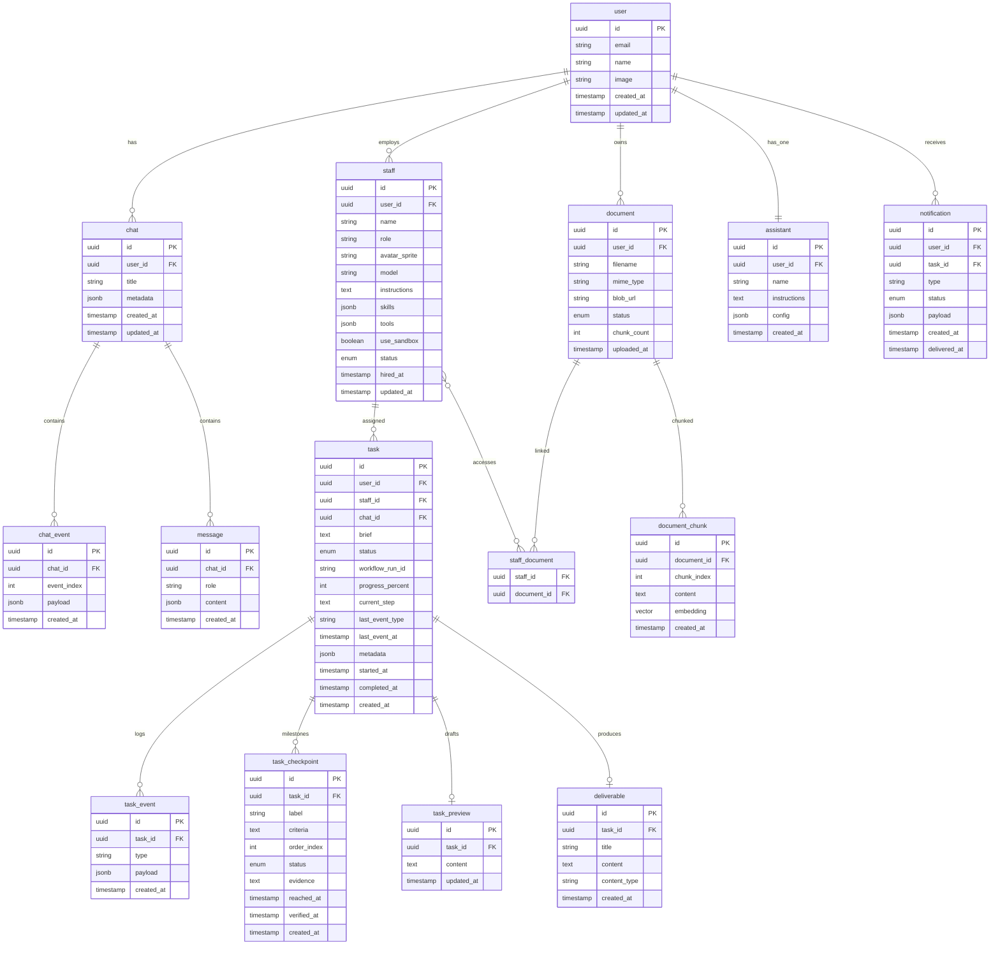

# Data Model — Nex Staff

## Entity Relationship Diagram



---

## Table Definitions (Drizzle)

### `user`

Managed by Better Auth. Extended fields optional.

```typescript
export const user = pgTable("user", {
  id: uuid("id").primaryKey().defaultRandom(),
  email: text("email").notNull().unique(),
  name: text("name"),
  image: text("image"),
  createdAt: timestamp("created_at").defaultNow().notNull(),
  updatedAt: timestamp("updated_at").defaultNow().notNull(),
});
```

### `assistant`

One per user, auto-created on first login.

```typescript
export const assistant = pgTable("assistant", {
  id: uuid("id").primaryKey().defaultRandom(),
  userId: uuid("user_id")
    .notNull()
    .references(() => user.id, { onDelete: "cascade" })
    .unique(),
  name: text("name").notNull().default("Assistant"),
  instructions: text("instructions").notNull(),
  config: jsonb("config").$type<AssistantConfig>().default({}),
  createdAt: timestamp("created_at").defaultNow().notNull(),
});

interface AssistantConfig {
  model?: string;
  greeting?: string;
}
```

### `staff`

Hired specialist agents, scoped per user.

```typescript
export const staffStatusEnum = pgEnum("staff_status", [
  "idle",
  "working",
  "offline",
]);

export const staff = pgTable("staff", {
  id: uuid("id").primaryKey().defaultRandom(),
  userId: uuid("user_id")
    .notNull()
    .references(() => user.id, { onDelete: "cascade" }),
  name: text("name").notNull(),
  role: text("role").notNull(),
  avatarSprite: text("avatar_sprite").notNull().default("default"),
  model: text("model"),
  instructions: text("instructions").notNull(),
  skills: jsonb("skills").$type<Skill[]>().default([]),
  tools: jsonb("tools").$type<ToolDef[]>().default([]),
  useSandbox: boolean("use_sandbox").notNull().default(false),
  status: staffStatusEnum("status").notNull().default("idle"),
  hiredAt: timestamp("hired_at").defaultNow().notNull(),
  updatedAt: timestamp("updated_at").defaultNow().notNull(),
});
```

### `task`

Async work items delegated to staff.

```typescript
export const taskStatusEnum = pgEnum("task_status", [
  "pending",
  "running",
  "completed",
  "failed",
  "cancelled",
]);

export const task = pgTable("task", {
  id: uuid("id").primaryKey().defaultRandom(),
  userId: uuid("user_id")
    .notNull()
    .references(() => user.id, { onDelete: "cascade" }),
  staffId: uuid("staff_id")
    .notNull()
    .references(() => staff.id),
  chatId: uuid("chat_id").references(() => chat.id),
  brief: text("brief").notNull(),
  status: taskStatusEnum("status").notNull().default("pending"),
  workflowRunId: text("workflow_run_id"),
  progressPercent: integer("progress_percent").default(0),
  currentStep: text("current_step"),
  lastEventType: text("last_event_type"),
  lastEventAt: timestamp("last_event_at"),
  metadata: jsonb("metadata").$type<TaskMetadata>().default({}),
  startedAt: timestamp("started_at"),
  completedAt: timestamp("completed_at"),
  createdAt: timestamp("created_at").defaultNow().notNull(),
});

interface TaskMetadata {
  retryCount?: number;
  parentTaskId?: string;
  parentGroupId?: string;
  dependsOn?: string[];
  acceptanceCriteria?: string;
  error?: string;
}
```

### `task_event`

Append-only progress log cho task observability.

**Event types** (non-exhaustive):

| Type | Layer |
|------|-------|
| `workflow.started`, `workflow.completed`, `workflow.failed` | Workflow |
| `sandbox.creating`, `sandbox.created` | Sandbox |
| `agent.step_started`, `agent.step_completed`, `agent.tool_called`, `agent.tool_result`, `agent.text_delta` | Agent |
| `checkpoint.reached`, `checkpoint.verified`, `checkpoint.failed` | Checkpoints |
| `worker.query_response` | Phase 2 — dynamic query |
| `deliverable.saved` | Output |

```typescript
export const taskEvent = pgTable("task_event", {
  id: uuid("id").primaryKey().defaultRandom(),
  taskId: uuid("task_id")
    .notNull()
    .references(() => task.id, { onDelete: "cascade" }),
  type: text("type").notNull(),
  payload: jsonb("payload").$type<Record<string, unknown>>().default({}),
  createdAt: timestamp("created_at").defaultNow().notNull(),
});
```

### `task_checkpoint`

Planned milestones — Assistant tạo khi delegate; worker báo cáo qua `checkpoint.reached` events.

```typescript
export const checkpointStatusEnum = pgEnum("checkpoint_status", [
  "pending",
  "reached",
  "verified",
  "failed",
]);

export const taskCheckpoint = pgTable("task_checkpoint", {
  id: uuid("id").primaryKey().defaultRandom(),
  taskId: uuid("task_id")
    .notNull()
    .references(() => task.id, { onDelete: "cascade" }),
  label: text("label").notNull(),
  criteria: text("criteria").notNull(),
  orderIndex: integer("order_index").notNull(),
  status: checkpointStatusEnum("status").notNull().default("pending"),
  evidence: text("evidence"),
  reachedAt: timestamp("reached_at"),
  verifiedAt: timestamp("verified_at"),
  createdAt: timestamp("created_at").defaultNow().notNull(),
});
```

**Indexes:** `(task_id, order_index)`, `(task_id, status)`.

### `task_preview`

Draft output tạm — cập nhật khi agent stream text, trước khi finalize deliverable.

```typescript
export const taskPreview = pgTable("task_preview", {
  id: uuid("id").primaryKey().defaultRandom(),
  taskId: uuid("task_id")
    .notNull()
    .references(() => task.id, { onDelete: "cascade" })
    .unique(),
  content: text("content").notNull().default(""),
  updatedAt: timestamp("updated_at").defaultNow().notNull(),
});
```

### `notification`

Queue thông báo cho Assistant và UI — track đã báo user chưa.

```typescript
export const notificationStatusEnum = pgEnum("notification_status", [
  "pending",
  "delivered",
]);

export const notification = pgTable("notification", {
  id: uuid("id").primaryKey().defaultRandom(),
  userId: uuid("user_id")
    .notNull()
    .references(() => user.id, { onDelete: "cascade" }),
  taskId: uuid("task_id").references(() => task.id, { onDelete: "cascade" }),
  type: text("type").notNull(),
  status: notificationStatusEnum("status").notNull().default("pending"),
  payload: jsonb("payload").$type<Record<string, unknown>>().default({}),
  createdAt: timestamp("created_at").defaultNow().notNull(),
  deliveredAt: timestamp("delivered_at"),
});
```

### `deliverable`

Output produced by completed tasks.

```typescript
export const deliverable = pgTable("deliverable", {
  id: uuid("id").primaryKey().defaultRandom(),
  taskId: uuid("task_id")
    .notNull()
    .references(() => task.id, { onDelete: "cascade" })
    .unique(),
  title: text("title").notNull(),
  content: text("content").notNull(),
  contentType: text("content_type").notNull().default("text/markdown"),
  createdAt: timestamp("created_at").defaultNow().notNull(),
});
```

### `document`

User-uploaded files for RAG.

```typescript
export const documentStatusEnum = pgEnum("document_status", [
  "uploading",
  "processing",
  "ready",
  "failed",
]);

export const document = pgTable("document", {
  id: uuid("id").primaryKey().defaultRandom(),
  userId: uuid("user_id")
    .notNull()
    .references(() => user.id, { onDelete: "cascade" }),
  filename: text("filename").notNull(),
  mimeType: text("mime_type").notNull(),
  blobUrl: text("blob_url").notNull(),
  status: documentStatusEnum("status").notNull().default("uploading"),
  chunkCount: integer("chunk_count").default(0),
  uploadedAt: timestamp("uploaded_at").defaultNow().notNull(),
});
```

### `document_chunk`

Vector-indexed chunks for RAG.

```typescript
export const documentChunk = pgTable("document_chunk", {
  id: uuid("id").primaryKey().defaultRandom(),
  documentId: uuid("document_id")
    .notNull()
    .references(() => document.id, { onDelete: "cascade" }),
  chunkIndex: integer("chunk_index").notNull(),
  content: text("content").notNull(),
  embedding: vector("embedding", { dimensions: 1536 }),
  createdAt: timestamp("created_at").defaultNow().notNull(),
});
```

### `staff_document`

Many-to-many: staff access to documents.

```typescript
export const staffDocument = pgTable(
  "staff_document",
  {
    staffId: uuid("staff_id")
      .notNull()
      .references(() => staff.id, { onDelete: "cascade" }),
    documentId: uuid("document_id")
      .notNull()
      .references(() => document.id, { onDelete: "cascade" }),
  },
  (t) => [primaryKey({ columns: [t.staffId, t.documentId] })],
);
```

### `chat`

Conversation sessions.

```typescript
export const chat = pgTable("chat", {
  id: uuid("id").primaryKey().defaultRandom(),
  userId: uuid("user_id")
    .notNull()
    .references(() => user.id, { onDelete: "cascade" }),
  title: text("title"),
  metadata: jsonb("metadata").$type<ChatMetadata>().default({}),
  createdAt: timestamp("created_at").defaultNow().notNull(),
  updatedAt: timestamp("updated_at").defaultNow().notNull(),
});
```

### `chat_event`

Event-sourced stream log for chat resume/reload.

```typescript
export const chatEvent = pgTable(
  "chat_event",
  {
    id: uuid("id").primaryKey().defaultRandom(),
    chatId: uuid("chat_id")
      .notNull()
      .references(() => chat.id, { onDelete: "cascade" }),
    eventIndex: integer("event_index").notNull(),
    payload: jsonb("payload").notNull(),
    createdAt: timestamp("created_at").defaultNow().notNull(),
  },
  (t) => [
    uniqueIndex("chat_event_chat_id_event_index").on(t.chatId, t.eventIndex),
  ],
);
```

### `message`

Denormalized messages for quick chat history load.

```typescript
export const message = pgTable("message", {
  id: uuid("id").primaryKey().defaultRandom(),
  chatId: uuid("chat_id")
    .notNull()
    .references(() => chat.id, { onDelete: "cascade" }),
  role: text("role").notNull(), // "user" | "assistant" | "system"
  content: jsonb("content").notNull(),
  createdAt: timestamp("created_at").defaultNow().notNull(),
});
```

---

## Indexes

| Index                  | Table          | Columns                      | Purpose                  |
| ---------------------- | -------------- | ---------------------------- | ------------------------ |
| `staff_user_status`    | staff          | `(user_id, status)`          | List active staff        |
| `task_staff_status`    | task           | `(staff_id, status)`         | Staff workload           |
| `task_user_status`     | task           | `(user_id, status)`          | User task list           |
| `task_workflow_run`    | task           | `(workflow_run_id)`          | Workflow status lookup   |
| `task_event_task`      | task_event     | `(task_id, created_at)`      | Event timeline           |
| `notification_user`    | notification   | `(user_id, status)`          | Pending notifications  |
| `document_user`        | document       | `(user_id)`                  | User documents           |
| `chunk_document`       | document_chunk | `(document_id, chunk_index)` | Chunk retrieval          |
| `chunk_embedding_hnsw` | document_chunk | `embedding` (HNSW)           | Vector similarity search |
| `chat_user`            | chat           | `(user_id, updated_at DESC)` | Chat sidebar             |
| `message_chat`         | message        | `(chat_id, created_at)`      | Message history          |

### pgvector HNSW Index

```sql
CREATE INDEX chunk_embedding_hnsw ON document_chunk
  USING hnsw (embedding vector_cosine_ops)
  WITH (m = 16, ef_construction = 64);
```

---

## RAG Query Pattern

```typescript
async function searchDocuments(
  userId: string,
  query: string,
  documentIds?: string[],
) {
  const embedding = await embed({ model: embeddingModel, value: query });

  const results = await db
    .select({
      content: documentChunk.content,
      filename: document.filename,
      similarity: sql<number>`1 - (${documentChunk.embedding} <=> ${embedding.embedding})`,
    })
    .from(documentChunk)
    .innerJoin(document, eq(documentChunk.documentId, document.id))
    .where(
      and(
        eq(document.userId, userId),
        eq(document.status, "ready"),
        documentIds ? inArray(document.id, documentIds) : undefined,
      ),
    )
    .orderBy(sql`${documentChunk.embedding} <=> ${embedding.embedding}`)
    .limit(5);

  return results;
}
```

---

## Data Lifecycle

| Entity      | Created         | Updated              | Deleted                      |
| ----------- | --------------- | -------------------- | ---------------------------- |
| user        | OAuth signup    | Profile edit         | Account delete (cascade all) |
| assistant   | First login     | Instructions edit    | With user                    |
| staff       | `hire_staff`    | Status, instructions | User removes staff           |
| task        | `delegate_task` | Status transitions   | Auto-archive after 90 days   |
| deliverable | Task complete   | Immutable            | With task                    |
| document    | Upload          | Re-process on update | User delete (cascade chunks) |
| chat        | First message   | Title auto-update    | User delete                  |

---

## Tài liệu liên quan

- [ARCHITECTURE.md](ARCHITECTURE.md) — How data flows through the system
- [API.md](API.md) — REST endpoints using these tables
- [AGENT-SYSTEM.md](AGENT-SYSTEM.md) — Checkpoints, supervision, task metadata usage
- [EVAL-FRAMEWORK.md](EVAL-FRAMEWORK.md) — Metrics sourced from task/task_event tables
