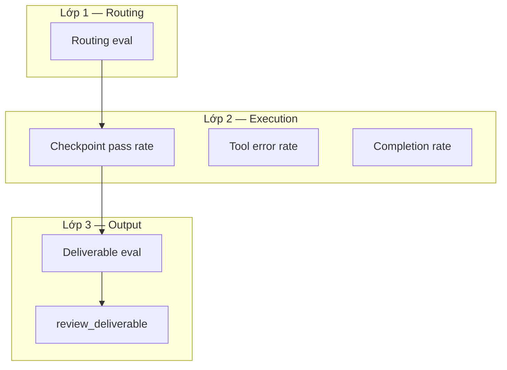

# Eval Framework — Nex Staff

Tài liệu này trả lời: **làm sao evaluate chất lượng worker agent?** — metrics, loại test, và cấu trúc eval harness.

Liên quan: [PRD.md § Evaluation Strategy](PRD.md), [ROADMAP.md § Success Metrics](ROADMAP.md), [AGENT-SYSTEM.md § Supervision](AGENT-SYSTEM.md).

---

## Mapping với docs hiện có

| Thành phần | File gốc | Phạm vi đánh giá |
|------------|----------|------------------|
| **Routing accuracy** ≥ 90% | PRD, ROADMAP | Assistant chọn đúng staff — **không** đo output worker |
| **Deliverable quality** ≥ 7/10 human eval | PRD | Chất lượng **output cuối** |
| **Task completion rate** ≥ 80% | ROADMAP Phase 2 | **Reliability** worker |
| **RAG citation accuracy** ≥ 85% | ROADMAP Phase 2 | Chất lượng **tool usage** (research staff) |
| **20-scenario benchmark** | PRD, ROADMAP risks | Test suite end-to-end Assistant + worker |
| **Latency KPIs** | PRD | first token < 1s; notification < 30s |

Doc này bổ sung **per-staff metrics**, **loại test chi tiết**, và **eval harness structure** — chưa có trong PRD/ROADMAP.

---

## Ba lớp đánh giá



| Lớp | Câu hỏi | Khi chạy |
|-----|---------|----------|
| **Routing** | Assistant delegate đúng staff không? | Mỗi delegate; CI routing suite |
| **Execution** | Worker có hoàn thành đúng quy trình không? | Trong lúc task chạy (checkpoints) + sau task |
| **Output** | Deliverable có usable không? | Sau `workflow.completed` |

---

## A. Metrics theo worker (per-staff dashboard)

Aggregate từ DB + eval harness. Hiển thị trên `/staff` hoặc internal admin (Phase 2+).

| Metric | Công thức | Nguồn data |
|--------|-----------|------------|
| `completion_rate` | `completed / (completed + failed)` | `task.status` WHERE `staff_id` |
| `avg_duration_ms` | `AVG(completedAt - startedAt)` | `task` |
| `retry_rate` | tasks có `metadata.retryCount > 0` / total | `task.metadata` |
| `deliverable_score` | LLM-judge hoặc human rubric 1–10 | eval harness / `review_deliverable` |
| `checkpoint_pass_rate` | checkpoints `verified` / total checkpoints | `task_checkpoint` |
| `tool_error_rate` | `agent.tool_result` với error / total tool calls | `task_event` |
| `routing_accuracy` | delegate đúng staff / total scenarios | eval harness routing runner |

**Target tham chiếu** (từ PRD/ROADMAP):

| Metric | Target | Phase |
|--------|--------|-------|
| Routing accuracy | ≥ 90% | 1 |
| Deliverable score (human) | ≥ 7/10 | 1 |
| Task completion rate | ≥ 80% | 2 |
| RAG citation accuracy | ≥ 85% | 2 |
| Checkpoint pass rate | ≥ 85% | 1.5 |

---

## B. Loại test

### 1. Routing eval

**Mục đích:** Assistant chọn đúng staff hoặc đề xuất hire phù hợp.

**Input:** User message + existing roster (mock DB).

**Assert:**
- `delegate_task.staffId` match expected role, hoặc
- `hire_staff.role` match expected role khi roster trống

**Scenarios:** 20 kịch bản PRD — 5 hire mới, 10 delegate existing, 5 edge cases.

Ví dụ scenario YAML:

```yaml
id: routing-01
userMessage: "Viết blog 800 từ về AI agents cho startup founders"
roster:
  - { name: Alex, role: Content Writer, status: idle }
expected:
  action: delegate_task
  staffRole: Content Writer
```

### 2. Deliverable eval

**Mục đích:** Output usable không cần sửa lớn.

**Rubric dimensions** (1–10 mỗi dimension, weighted average):

| Dimension | Weight | Mô tả |
|-----------|--------|-------|
| Relevance | 30% | Trả lời đúng brief |
| Completeness | 25% | Đủ nội dung yêu cầu |
| Tone | 15% | Khớp tone trong brief/metadata |
| Citations | 20% | Research tasks: có nguồn hợp lệ |
| Format | 10% | Markdown/structure đúng yêu cầu |

**Pass threshold:** weighted score ≥ 7.0 (khớp PRD).

**Methods:**
- **LLM-as-judge** — automated trong CI (fast, noisy)
- **Human spot-check** — 10% sample mỗi sprint (ground truth)

Rubrics chi tiết: `eval/rubrics/` (xem § C).

### 3. Regression eval

**Mục đích:** Staff không drift sau thay đổi prompt/model.

**Golden tasks:** 5–10 fixed briefs per staff template, chạy lại sau mỗi deploy.

**Assert:** `deliverable_score` không giảm > 1 điểm so với baseline snapshot.

### 4. Tool eval

**Mục đích:** RAG/sandbox tools hoạt động đúng.

**Ví dụ RAG test:**
- Seed mock document với known facts
- Delegate research task
- Assert deliverable cites document ID + fact matches

**Ví dụ sandbox test:**
- Delegate analyst task với CSV fixture
- Assert output file exists + chart generated

### 5. Integration eval

**Mục đích:** Full workflow hire → delegate → deliver.

**Trigger:** CI nightly against Vercel preview.

**Flow:**
1. Create test user + Assistant
2. Run hire scenario (if needed)
3. Delegate + poll `check_task_status` until terminal
4. Run deliverable eval + checkpoint pass rate assert

---

## C. Eval harness (thiết kế)

Chưa implement — cấu trúc đề xuất:

```
eval/
  scenarios/
    routing/           # YAML: user message, roster, expected action
    deliverable/       # YAML: brief, staff template, rubric ref
    integration/       # YAML: full E2E flows
  runners/
    routing.ts         # assert delegate target
    deliverable.ts     # LLM-as-judge + score aggregation
    integration.ts     # poll task + run deliverable eval
  rubrics/
    blog-post.md       # tiêu chí chấm Content Writer
    research-report.md # tiêu chí chấm Researcher
    data-analysis.md   # tiêu chí chấm Analyst
  fixtures/
    documents/         # mock PDFs/MD for RAG tests
    csv/               # sample data for Analyst
  baseline/
    golden-scores.json # regression baseline per scenario
```

### Runner interface (sketch)

```typescript
interface EvalScenario {
  id: string;
  type: "routing" | "deliverable" | "integration";
  input: Record<string, unknown>;
  expected: Record<string, unknown>;
  rubric?: string; // path to rubrics/*.md
}

interface EvalResult {
  scenarioId: string;
  passed: boolean;
  score?: number;
  details: Record<string, unknown>;
}
```

### CI integration

| Job | Trigger | Scenarios |
|-----|---------|-----------|
| `eval:routing` | Every PR | 20 routing scenarios (mock, no LLM worker) |
| `eval:deliverable` | Nightly | 5 deliverable scenarios (full worker run) |
| `eval:regression` | Pre-release | Golden tasks vs baseline |

---

## D. Rubrics mẫu

### blog-post.md (Content Writer)

```markdown
# Blog Post Rubric

## Relevance (30%)
- [ ] Addresses the topic in the brief
- [ ] Target audience appropriate
- [ ] No major off-topic sections

## Completeness (25%)
- [ ] Meets word count if specified
- [ ] Has intro, body, conclusion
- [ ] Covers key points from brief

## Tone (15%)
- [ ] Matches requested tone (casual/formal/technical)

## Format (10%)
- [ ] Valid markdown
- [ ] Headings hierarchy sensible
- [ ] No broken formatting

Score: average of dimension scores (1-10 each).
Pass: ≥ 7.0 weighted.
```

---

## E. Liên kết với Supervision Loop

Assistant đánh giá worker **trong runtime** qua tools (không chỉ offline eval):

| Tool | Eval layer | Doc |
|------|------------|-----|
| `verify_checkpoint` | Execution | [AGENT-SYSTEM.md § Task Checkpoints](AGENT-SYSTEM.md) |
| `review_deliverable` | Output | [AGENT-SYSTEM.md § Supervision](AGENT-SYSTEM.md) |
| `check_task_status` | Execution (observability) | [AGENT-SYSTEM.md § Task Observability](AGENT-SYSTEM.md) |

Offline eval harness (doc này) bổ sung **regression + benchmark** cho CI; runtime tools bổ sung **per-task quality gate**.

---

## F. Roadmap eval

| Phase | Deliverable |
|-------|-------------|
| 1 | Eval harness MVP: routing runner + 5 deliverable scenarios |
| 1.5 | Checkpoint pass rate metric; `verify_checkpoint` integration tests |
| 2 | Regression golden tasks; RAG tool eval; per-staff dashboard |
| 3 | Eval-driven "level up" — chỉ update staff instructions khi score ≥ baseline |

Chi tiết timeline: [ROADMAP.md](ROADMAP.md).

---

## Tài liệu liên quan

- [PRD.md](PRD.md) — Evaluation Strategy, KPIs
- [ROADMAP.md](ROADMAP.md) — Success metrics by phase
- [AGENT-SYSTEM.md](AGENT-SYSTEM.md) — Supervision, checkpoints
- [API.md](API.md) — `review_deliverable`, `verify_checkpoint` tool specs
