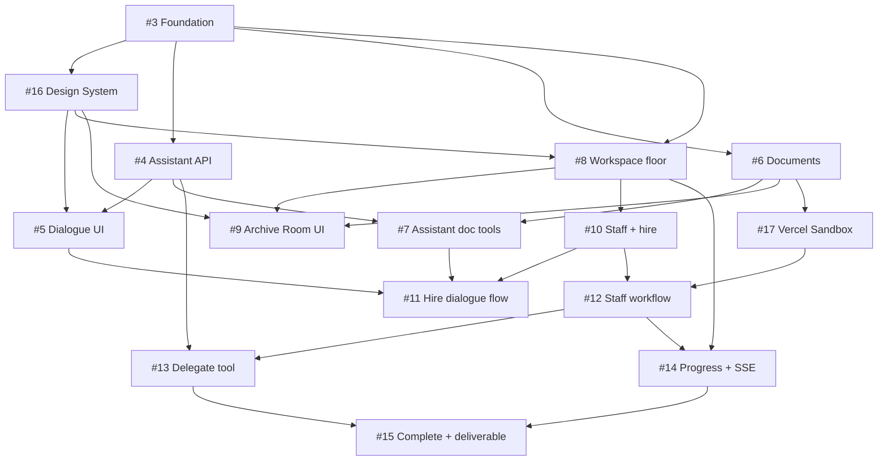

# MVP Plan — Nex Staff

## Goals

Ship MVP for solo founder with **5 pillars**:

1. **Assistant** — discuss project, add & save documents
2. **Hire** — recruit one new agent (preset template)
3. **Delegate** — assign tasks, track progress, notify on completion, view results
4. **Workplace** — pixel workspace floor, agents at desks, document archive room
5. **Unified 8-bit UI** — entire app shares one retro game visual language; not a chat app / dashboard

> **UI is first-class.** Every feature issue (#5, #8, #9…) must build on [#16 Design System](https://github.com/tihado/nex-staff/issues/16). Do not use shadcn/default chat patterns for the main screen.

## Out of scope (MVP)

- RAG / pgvector (store files + metadata only; search later)
- Multiple preset staff (MVP: 1 Writer template)
- Full slash commands
- Team / billing / rate limiting

## In scope (MVP) — Vercel Sandbox

- **Required** for staff execution — [#17](https://github.com/tihado/nex-staff/issues/17)
- Per-task `createVercelSandbox`, seed docs from Archive, sandbox file/shell tools
- Writer preset: `useSandbox: true` (read brief, write draft `.md`, upload deliverable)
- Progress events `sandbox.creating` / `sandbox.created` + pixel "preparing..." UI

## MVP Architecture

```
Workplace (home)
  ├── Reception → Dialogue + Assistant
  ├── Desks → Dialogue + Staff
  ├── Archive Room → Documents
  └── Task Board → Progress + deliverables

Assistant (ToolLoopAgent, sync)
  └── tools: hire_staff, delegate_task, check_task_status, list_active_tasks

Staff (DurableAgent + Workflow, async)
  ├── Vercel Sandbox per task (#17) — seed docs, read/write files
  └── reportProgress → SSE → Workplace UI
```

## Phases & Issues

| Phase | Week | Issues | Exit criteria |
|-------|------|--------|---------------|
| 0 Foundation | 1 | [#3](https://github.com/tihado/nex-staff/issues/3)–[#4](https://github.com/tihado/nex-staff/issues/4) | Login, DB, deploy |
| **0.5 UI Foundation** | 1 | [#16](https://github.com/tihado/nex-staff/issues/16) | Tokens + pixel components + `/design-system` demo |
| 1 Assistant + Docs | 1–2 | [#5](https://github.com/tihado/nex-staff/issues/5)–[#7](https://github.com/tihado/nex-staff/issues/7) | Dialogue + upload doc |
| 2 Workplace | 2 | [#8](https://github.com/tihado/nex-staff/issues/8)–[#9](https://github.com/tihado/nex-staff/issues/9) | Floor view + archive room |
| 3 Hire | 2–3 | [#10](https://github.com/tihado/nex-staff/issues/10)–[#11](https://github.com/tihado/nex-staff/issues/11) | Hire 1 Writer |
| 4 Delegate loop | 3–4 | [#12](https://github.com/tihado/nex-staff/issues/12)–[#15](https://github.com/tihado/nex-staff/issues/15), [#17](https://github.com/tihado/nex-staff/issues/17) | Sandbox + delegate → progress → complete → view result |

**Epic:** [#2 MVP — Nex Staff platform](https://github.com/tihado/nex-staff/issues/2)

## GitHub Issues

| # | Issue | Labels | Pillar |
|---|-------|--------|--------|
| 2 | [Epic: MVP](https://github.com/tihado/nex-staff/issues/2) | epic | — |
| 3 | [Foundation: Auth, DB, deploy](https://github.com/tihado/nex-staff/issues/3) | foundation | — |
| **16** | **[Design System: 8-bit foundation](https://github.com/tihado/nex-staff/issues/16)** | **ui, workplace** | **UI** |
| 4 | [Assistant API](https://github.com/tihado/nex-staff/issues/4) | assistant | Assistant |
| 5 | [Dialogue UI](https://github.com/tihado/nex-staff/issues/5) | assistant, workplace | Assistant |
| 6 | [Documents API](https://github.com/tihado/nex-staff/issues/6) | documents | Documents |
| 7 | [Assistant document tools](https://github.com/tihado/nex-staff/issues/7) | assistant, documents | Documents |
| 8 | [Workplace floor](https://github.com/tihado/nex-staff/issues/8) | workplace | Workplace |
| 9 | [Archive Room UI](https://github.com/tihado/nex-staff/issues/9) | workplace, documents | Workplace |
| 10 | [Staff + hire_staff](https://github.com/tihado/nex-staff/issues/10) | staff | Hire |
| 11 | [Hire dialogue flow](https://github.com/tihado/nex-staff/issues/11) | staff, assistant | Hire |
| 12 | [Staff workflow](https://github.com/tihado/nex-staff/issues/12) | staff, tasks, sandbox | Delegate |
| **17** | **[Vercel Sandbox](https://github.com/tihado/nex-staff/issues/17)** | **sandbox, staff** | **Delegate** |
| 13 | [Delegate task](https://github.com/tihado/nex-staff/issues/13) | tasks | Delegate |
| 14 | [Task progress + SSE](https://github.com/tihado/nex-staff/issues/14) | tasks, workplace | Delegate |
| 15 | [Completion + deliverable](https://github.com/tihado/nex-staff/issues/15) | tasks | Delegate |

## Dependency graph



## Definition of Done (MVP)

- [ ] User logs in with Google → enters Workplace (**pixel chrome**, not default Next.js page)
- [ ] Every overlay uses `PixelPanel` / shared tokens — no one-off styles
- [ ] Click Reception → dialogue with Assistant about project
- [ ] Upload PDF/MD → appears in Archive Room; Assistant knows file was saved
- [ ] Hire Content Writer via dialogue → sprite appears at desk
- [ ] "Write a blog about X" → delegate → sandbox spin-up → desk switches to `working`
- [ ] Progress shows `sandbox.creating` / steps; deliverable from file in sandbox
- [ ] Task Board shows progress %; user asks Assistant "how's progress?" → gets an answer
- [ ] Task complete → desk `!` + dialogue cutscene + view deliverable

## Related docs

- [PRD.md](PRD.md)
- [ARCHITECTURE.md](ARCHITECTURE.md)
- [AGENT-SYSTEM.md](AGENT-SYSTEM.md) — Task Observability
- [UI-UX.md](UI-UX.md) — Workplace + Dialogue
