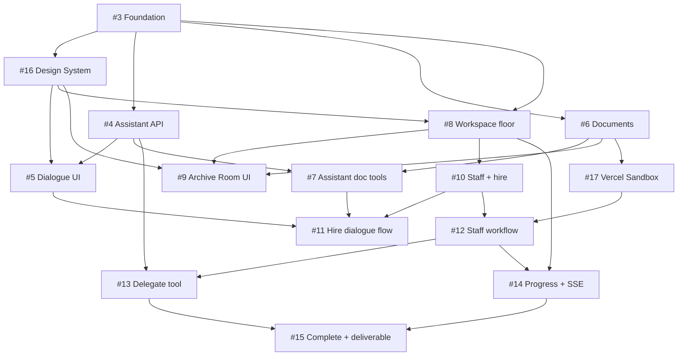

# MVP Plan — Nex Staff

## Mục tiêu

Ship MVP cho solo founder với **5 trụ cột**:

1. **Assistant** — trò chuyện về project, thêm & lưu tài liệu
2. **Hire** — tuyển 1 agent mới (preset template)
3. **Delegate** — giao việc, theo dõi tiến độ, thông báo hoàn thành, xem kết quả
4. **Workplace** — sàn làm việc pixel, agent ngồi bàn, phòng lưu tài liệu
5. **UI 8-bit thống nhất** — toàn app một visual language game retro; không chat app / dashboard

> **UI là first-class.** Mọi feature issue (#5, #8, #9…) phải build trên [#16 Design System](https://github.com/tihado/nex-staff/issues/16). Không dùng shadcn/default chat patterns cho màn hình chính.

## Out of scope (MVP)

- RAG / pgvector (chỉ lưu file + metadata, search sau)
- Nhiều preset staff (MVP: 1 template Writer)
- Slash commands đầy đủ
- Team / billing / rate limiting

## In scope (MVP) — Vercel Sandbox

- **Bắt buộc** cho staff execution — [#17](https://github.com/tihado/nex-staff/issues/17)
- Per-task `createVercelSandbox`, seed docs từ Archive, sandbox file/shell tools
- Writer preset: `useSandbox: true` (đọc brief, ghi draft `.md`, upload deliverable)
- Progress events `sandbox.creating` / `sandbox.created` + pixel "chuẩn bị..." UI

## Kiến trúc MVP

```
Workplace (home)
  ├── Reception → Dialogue + Assistant
  ├── Desks → Dialogue + Staff
  ├── Archive Room → Documents
  └── Task Board → Progress + deliverables

Assistant (ToolLoopAgent, sync)
  └── tools: hire_staff, delegate_task, check_task_status, list_active_tasks

Staff (DurableAgent + Workflow, async)
  ├── Vercel Sandbox per task (#17) — seed docs, read/write files
  └── reportProgress → SSE → Workplace UI
```

## Phases & Issues

| Phase | Tuần | Issues | Exit criteria |
|-------|------|--------|---------------|
| 0 Foundation | 1 | [#3](https://github.com/tihado/nex-staff/issues/3)–[#4](https://github.com/tihado/nex-staff/issues/4) | Login, DB, deploy |
| **0.5 UI Foundation** | 1 | [#16](https://github.com/tihado/nex-staff/issues/16) | Tokens + pixel components + `/design-system` demo |
| 1 Assistant + Docs | 1–2 | [#5](https://github.com/tihado/nex-staff/issues/5)–[#7](https://github.com/tihado/nex-staff/issues/7) | Dialogue + upload doc |
| 2 Workplace | 2 | [#8](https://github.com/tihado/nex-staff/issues/8)–[#9](https://github.com/tihado/nex-staff/issues/9) | Floor view + archive room |
| 3 Hire | 2–3 | [#10](https://github.com/tihado/nex-staff/issues/10)–[#11](https://github.com/tihado/nex-staff/issues/11) | Hire 1 Writer |
| 4 Delegate loop | 3–4 | [#12](https://github.com/tihado/nex-staff/issues/12)–[#15](https://github.com/tihado/nex-staff/issues/15), [#17](https://github.com/tihado/nex-staff/issues/17) | Sandbox + giao việc → progress → xong → xem kết quả |

**Epic:** [#2 MVP — Nex Staff platform](https://github.com/tihado/nex-staff/issues/2)

## GitHub Issues

| # | Issue | Labels | Pillar |
|---|-------|--------|--------|
| 2 | [Epic: MVP](https://github.com/tihado/nex-staff/issues/2) | epic | — |
| 3 | [Foundation: Auth, DB, deploy](https://github.com/tihado/nex-staff/issues/3) | foundation | — |
| **16** | **[Design System: 8-bit foundation](https://github.com/tihado/nex-staff/issues/16)** | **ui, workplace** | **UI** |
| 4 | [Assistant API](https://github.com/tihado/nex-staff/issues/4) | assistant | Assistant |
| 5 | [Dialogue UI](https://github.com/tihado/nex-staff/issues/5) | assistant, workplace | Assistant |
| 6 | [Documents API](https://github.com/tihado/nex-staff/issues/6) | documents | Documents |
| 7 | [Assistant document tools](https://github.com/tihado/nex-staff/issues/7) | assistant, documents | Documents |
| 8 | [Workplace floor](https://github.com/tihado/nex-staff/issues/8) | workplace | Workplace |
| 9 | [Archive Room UI](https://github.com/tihado/nex-staff/issues/9) | workplace, documents | Workplace |
| 10 | [Staff + hire_staff](https://github.com/tihado/nex-staff/issues/10) | staff | Hire |
| 11 | [Hire dialogue flow](https://github.com/tihado/nex-staff/issues/11) | staff, assistant | Hire |
| 12 | [Staff workflow](https://github.com/tihado/nex-staff/issues/12) | staff, tasks, sandbox | Delegate |
| **17** | **[Vercel Sandbox](https://github.com/tihado/nex-staff/issues/17)** | **sandbox, staff** | **Delegate** |
| 13 | [Delegate task](https://github.com/tihado/nex-staff/issues/13) | tasks | Delegate |
| 14 | [Task progress + SSE](https://github.com/tihado/nex-staff/issues/14) | tasks, workplace | Delegate |
| 15 | [Completion + deliverable](https://github.com/tihado/nex-staff/issues/15) | tasks | Delegate |

## Dependency graph



## Definition of Done (MVP)

- [ ] User login Google → vào Workplace (**pixel chrome**, không default Next.js page)
- [ ] Mọi overlay dùng `PixelPanel` / shared tokens — không one-off styles
- [ ] Click Reception → dialogue với Assistant về project
- [ ] Upload PDF/MD → hiện trong Archive Room; Assistant biết file đã lưu
- [ ] Hire Content Writer qua dialogue → sprite xuất hiện tại desk
- [ ] "Viết blog về X" → delegate → sandbox spin-up → desk chuyển `working`
- [ ] Progress hiện `sandbox.creating` / steps; deliverable từ file trong sandbox
- [ ] Task Board hiện progress %; user hỏi Assistant "tiến độ thế nào" → trả lời được
- [ ] Task xong → desk `!` + dialogue cutscene + xem deliverable

## Tài liệu tham chiếu

- [PRD.md](PRD.md)
- [ARCHITECTURE.md](ARCHITECTURE.md)
- [AGENT-SYSTEM.md](AGENT-SYSTEM.md) — Task Observability
- [UI-UX.md](UI-UX.md) — Workplace + Dialogue
