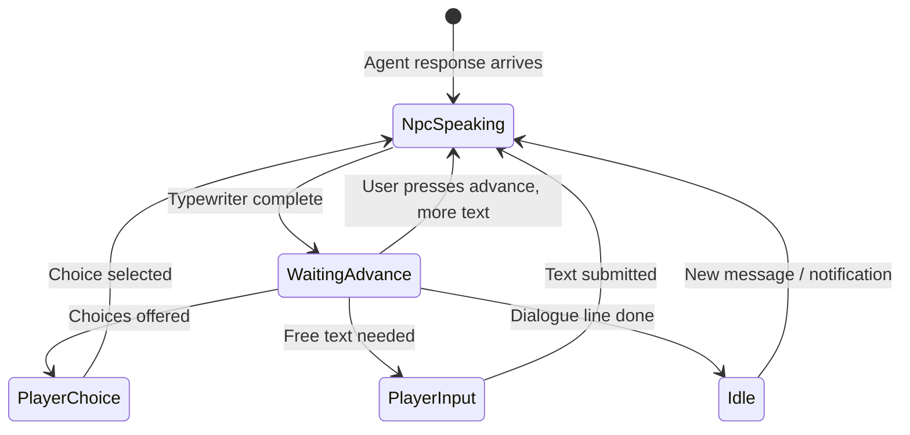
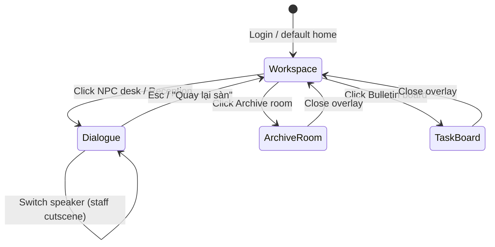

# UI/UX Design — Nex Staff

## Design Philosophy

### Hai màn hình chính

Nex Staff có **hai view** bổ sung nhau — không phải dashboard truyền thống:

| View | Vai trò | Tham chiếu game |
|------|---------|-----------------|
| **Workspace** | Sàn làm việc top-down — đi lại, xem staff, phòng tài liệu | Stardew Valley interior, Habbo room, old Sim office |
| **Dialogue** | Hội thoại NPC khi tương tác với agent | Pokémon, Final Fantasy dialogue box |

User **khám phá workspace** như một văn phòng pixel → **click vào bàn/NPC** → chuyển sang dialogue mode.

### NPC Dialogue (không phải chat truyền thống)

Toàn bộ interaction mô phỏng **hội thoại với NPC trong game RPG 8-bit** — không dùng bubble chat scrollable như Messenger/ChatGPT. User đứng trước một nhân vật (Assistant hoặc Staff), đọc dialogue box ở dưới màn hình, bấm để tiếp tục hoặc chọn lựa chọn.

Tham chiếu visual: Pokémon, Final Fantasy, Undertale, Stardew Valley dialogue system.

### Game-like

User là "boss" trong pixel office. Assistant = NPC receptionist/coordinator luôn có mặt. Staff = NPC specialists xuất hiện khi được gọi hoặc báo cáo xong việc. Hire = recruit character vào roster. Delegate = giao quest.

### 8-bit retro aesthetic

Pixel art scene, sprite portraits, dialogue box cổ điển, typewriter text, chiptune SFX (Phase 3). Identity của product — không phải skin trên chat app.

### Quy tắc thống nhất (implementation contract)

Mọi màn hình và component phải tuân theo **một design system** — xem issue [#16](https://github.com/tihado/nex-staff/issues/16) và thư mục `src/components/pixel/`.

| Layer | Quy tắc |
|-------|---------|
| **Tokens** | Chỉ dùng palette/fonts trong doc này — không hardcode màu lẻ |
| **Components** | Overlay, button, dialogue, notification → `Pixel*` shared components |
| **Patterns** | Workspace home + dialogue overlay — không thêm dashboard/list view |
| **Assets** | Sprite thiếu → emoji fallback, nhưng **chrome vẫn pixel** (border, font, HUD) |
| **shadcn** | Không dùng cho UI chính; chỉ settings/admin nếu cần |

**Review gate:** PR UI mới phải pass checklist anti-patterns cuối doc trước khi merge.

---

## Core Pattern: RPG Dialogue System



**Nguyên tắc vàng (Dialogue):** Một thời điểm chỉ có **một dialogue box active** — không hiển thị lịch sử scroll như chat app. Lịch sử truy cập qua overlay "Log" (tùy chọn).

---

## App Navigation



| Action | From | To |
|--------|------|-----|
| Login | — | Workspace (spawn tại Boss desk) |
| Click Reception | Workspace | Dialogue với Assistant |
| Click Staff desk | Workspace | Dialogue với Staff đó |
| Click Empty desk | Workspace | Hire flow (dialogue + choices) |
| Click Archive room | Workspace | Archive overlay |
| Click Task board | Workspace | Active tasks overlay |
| `Esc` / Back | Dialogue | Workspace |
| Task complete notification | Any | Workspace highlight desk + optional cutscene |

**Default home screen = Workspace** — không phải dialogue. Dialogue là mode tương tác sâu.

---

## Workspace View — Sàn làm việc

### Concept

Top-down (hoặc slight isometric) pixel office mà user có thể **đi lại** và **tương tác** với các vùng. Mỗi staff có bàn làm việc riêng; trạng thái hiển thị trực quan (đang ngồi, đang làm việc, bàn trống). Không phải list/table — là **không gian có thể khám phá**.

### Floor Plan

```
┌─────────────────────────────────────────────────────────────────┐
│  ■ NEX STAFF — WORKSPACE              Floor 1    [?] [⚙]        │
├─────────────────────────────────────────────────────────────────┤
│                                                                 │
│   ┌─────────────┐                        ┌──────────────────┐   │
│   │  ARCHIVE    │                        │   TASK BOARD     │   │
│   │  ROOM 📚    │                        │   📋 2 active    │   │
│   │  (documents)│                        │                  │   │
│   └─────────────┘                        └──────────────────┘   │
│                                                                 │
│         ┌────────┐  ┌────────┐  ┌────────┐  ┌────────┐         │
│         │ DESK   │  │ DESK   │  │ DESK   │  │ EMPTY  │         │
│         │ Alex   │  │ Sam    │  │ ◉ work │  │ + Hire │         │
│         │ Writer │  │Research│  │ Kim    │  │        │         │
│         │ ● idle │  │ ● idle │  │Analyst │  │        │         │
│         └────────┘  └────────┘  └────────┘  └────────┘         │
│                                                                 │
│   ┌─────────────────────────────────────────────────────────┐   │
│   │              RECEPTION — Assistant 🤖                    │   │
│   │              "Chào boss! Bấm để nói chuyện"              │   │
│   └─────────────────────────────────────────────────────────┘   │
│                                                                 │
│                              ┌────────┐                         │
│                              │  BOSS  │  ← Player spawn        │
│                              │  DESK  │                         │
│                              │  👤    │                         │
│                              └────────┘                         │
│                                                                 │
│  [WASD / click-to-move]              [Talk: Enter / Click NPC] │
└─────────────────────────────────────────────────────────────────┘
```

### Zones (vùng tương tác)

| Zone | Vị trí | Tương tác | Mở |
|------|--------|-----------|-----|
| **Reception** | Bottom-center | Nói với Assistant | Dialogue mode |
| **Staff desks** | Open floor grid | Nói với staff / xem status | Dialogue mode |
| **Empty desks** | Unhired slots | Hire staff mới | Hire dialogue flow |
| **Archive Room** | Top-left | Quản lý tài liệu | Archive overlay |
| **Task Board** | Top-right | Xem tasks đang chạy | Task board overlay |
| **Boss Desk** | Bottom | Spawn point; click = menu nhanh | Quick menu overlay |

### Desk States (visual)

| State | Visual | Animation |
|-------|--------|-----------|
| `idle` | NPC ngồi tại desk, green status dot | 2-frame typing idle |
| `working` | NPC + papers/screen glow, yellow dot | Fast typing, occasional sparkle |
| `done` | `!` emote bubble trên đầu | Bounce until user clicks |
| `empty` | Desk + chair, bảng "FOR HIRE" | Subtle blink on sign |
| `offline` | Desk empty, grayed out | None |

```typescript
interface WorkspaceDesk {
  id: string;
  staffId?: string;          // null = empty desk
  gridPosition: { x: number; y: number };
  state: "idle" | "working" | "done" | "empty" | "offline";
  label: string;             // "Alex — Writer"
}
```

### Player Movement

**Desktop:**
- **Click-to-move**: click tile → player sprite pathfind tới đó (A* trên grid)
- **WASD / Arrow keys**: di chuyển 4 hướng (grid-based, 16px per step)
- Đứng cạnh interactive zone + **Enter** hoặc **click zone** → activate

**Mobile:**
- Tap zone trực tiếp (không cần walk — auto pathfind)
- Virtual D-pad optional

```typescript
interface WorkspacePlayer {
  position: { x: number; y: number };  // grid coords
  direction: "up" | "down" | "left" | "right";
  sprite: string;
}
```

### Archive Room (Phòng lưu tài liệu)

Overlay kiểu **game storage room** — kệ sách pixel, mỗi document = một item trên kệ.

```
╔═ ARCHIVE ROOM ═══════════════════════════════════ [X] ═╗
║                                                        ║
║   ┌────┐  ┌────┐  ┌────┐  ┌────┐  ┌────┐             ║
║   │PDF │  │ MD │  │PDF │  │ +  │  │    │   ← shelves  ║
║   │spec│  │readme│ │report│ │upload│       row 1    ║
║   └────┘  └────┘  └────┘  └────┘  └────┘             ║
║                                                        ║
║   ┌────┐  ┌────┐                                       ║
║   │URL │  │    │                          row 2       ║
║   │clip│  │    │                                       ║
║   └────┘  └────┘                                       ║
║                                                        ║
║  Selected: product-spec.pdf (12 chunks)  [Xóa] [Gán staff] ║
╚════════════════════════════════════════════════════════╝
```

**Actions:**
- Click item → preview metadata + chunk count
- `+` slot → upload (file picker hoặc URL paste)
- "Gán staff" → chọn staff nào được access document này
- Drag item to staff desk (Phase 2) — visual link documents

### Task Board (Bảng công việc)

Bulletin board — sticky notes hiển thị **progress real-time** từ `task.progress` SSE.

```
╔═ TASK BOARD ═══════════════════════════════════════ [X] ═╗
║  ┌──────────────┐  ┌──────────────┐                       ║
║  │ ▶ Viết blog  │  │ ◉ Research   │                       ║
║  │ Alex         │  │ Sam          │                       ║
║  │ ████░░ 45%   │  │ ██░░░░ 30%   │  ← progress bar      ║
║  │ Đang viết... │  │ Searching... │  ← currentStep       ║
║  └──────────────┘  └──────────────┘                       ║
╚══════════════════════════════════════════════════════════╝
```

Click sticky note → dialogue với staff đó hoặc preview overlay (`get_task_preview`).

### Workspace → Dialogue Transition

Khi user activate NPC (Reception hoặc desk):

1. Camera **zoom/pan** tới NPC (300ms step animation, không smooth ease — retro cut)
2. Dialogue box **slide up** từ bottom
3. Workspace vẫn visible phía sau (dimmed 50%) hoặc freeze
4. `Esc` → dialogue đóng, camera pan về player position

```typescript
type AppView = "workspace" | "dialogue" | "overlay";

interface AppState {
  view: AppView;
  overlay?: "archive" | "task-board" | "deliverable" | "party-roster" | "log";
  dialogueTarget?: { type: "assistant" } | { type: "staff"; staffId: string };
  player: WorkspacePlayer;
  desks: WorkspaceDesk[];
}
```

### Workspace Component Tree

```
<WorkspaceScreen>
  <WorkspaceHUD />                    // floor label, staff count
  <WorkspaceFloor map={officeMap} />  // tilemap renderer
  <WorkspaceDesks desks={desks} />    // interactive desk zones
  <WorkspaceNPCs />                   // staff + assistant sprites
  <WorkspacePlayer />                 // boss sprite, movement
  <WorkspaceZones />                  // archive, task board hit areas
  {view === "dialogue" && (
    <DialogueOverlay dimmed>
      <DialogueBox ... />
      <ChoiceMenu ... />
    </DialogueOverlay>
  )}
  {overlay === "archive" && <ArchiveRoomOverlay />}
  {overlay === "task-board" && <TaskBoardOverlay />}
</WorkspaceScreen>
```

### Tilemap Spec

| Layer | Content |
|-------|---------|
| `floor` | Carpet/wood tiles |
| `walls` | Office walls, windows |
| `furniture` | Desks, chairs, shelves (non-interactive) |
| `interactive` | Click zones (invisible or highlighted on hover) |
| `entities` | Player + NPC sprites (rendered above) |

- Tile size: **16×16px**
- Map size: **32×24 tiles** (512×384 native, scaled to fit viewport)
- Format: JSON tilemap (Tiled editor) hoặc 2D array in code

### Hire Flow trên Workspace

1. User click **Empty desk** hoặc bảng "FOR HIRE"
2. Camera pan tới desk
3. Dialogue: Assistant xuất hiện (walk từ reception) — "Muốn hire ai cho bàn này?"
4. Sau hire thành công:
   - Desk state: `empty` → `idle`
   - NPC sprite spawn tại chair
   - Particle effect "✨ New hire!"
   - Quest banner: "{name} joined the team!"

---

## Visual Language

### Typography

| Use              | Font           | Fallback  |
| ---------------- | -------------- | --------- |
| NPC name plate   | Press Start 2P | monospace |
| Dialogue body    | VT323          | monospace |
| Choice menu      | Press Start 2P | monospace |
| Code/deliverable | JetBrains Mono | monospace |

```css
@import url("https://fonts.googleapis.com/css2?family=Press+Start+2P&family=VT323&display=swap");

:root {
  --font-pixel: "Press Start 2P", monospace;
  --font-body: "VT323", monospace;
  --font-size-dialogue: 22px;
  --font-size-nameplate: 10px;
  --line-height: 1.5;
}
```

### Color Palette

| Token               | Hex       | Usage                               |
| ------------------- | --------- | ----------------------------------- |
| `--bg-scene`        | `#1A0F3D` | Office/scene background             |
| `--bg-dialogue`     | `#0F0829` | Dialogue box fill                   |
| `--border-dialogue` | `#F0F0F0` | Dialogue box border (classic white) |
| `--accent`          | `#7EC8E3` | Choice highlight, active cursor     |
| `--highlight`       | `#FFE66D` | Important words, quest items        |
| `--success`         | `#4ECDC4` | Quest complete, staff idle          |
| `--alert`           | `#FF6B6B` | Errors, exclamation                 |
| `--text-primary`    | `#F0F0F0` | Dialogue text                       |
| `--text-muted`      | `#8888AA` | Secondary, log entries              |
| `--nameplate-bg`    | `#2D1B69` | NPC name tab background             |
| `--choice-bg`       | `#1E3A5F` | Choice button default               |
| `--choice-hover`    | `#7EC8E3` | Choice button selected              |

> **Đã bỏ** `--bubble-user/assistant/staff` — không dùng chat bubbles.

### Sprites

| Asset            | Size                          | Usage                                 |
| ---------------- | ----------------------------- | ------------------------------------- |
| Scene background | 320×180 hoặc 480×270 (scaled) | Pixel office interior                 |
| NPC portrait     | 96×96 hoặc 128×128            | Trong dialogue box, overlap cạnh trái |
| NPC overworld    | 32×32 hoặc 48×48              | Workspace floor + dialogue scene |
| Emote icons      | 16×16                         | `!` `?` `♪` khi staff báo cáo         |

```css
.sprite,
.portrait {
  image-rendering: pixelated;
  image-rendering: crisp-edges;
}
```

---

## Dialogue Overlay Layout

Dialogue hiện **overlay trên Workspace** (workspace dimmed 50% phía sau). Không phải màn hình riêng biệt.

### Desktop — Dialogue overlay

```
┌─────────────────────────────────────────────────────────────┐
│  ■ NEX STAFF — WORKSPACE (dimmed)           [Log]  [⚙]     │
├─────────────────────────────────────────────────────────────┤
│  ... workspace floor visible but dimmed ...                 │
│              ┌────┐                                         │
│              │ 🤖 │  ← zoomed NPC                           │
│              └────┘                                         │
│  ┌────────┐ ┌─────────────────────────────────────────────┐ │
│  │Portrait│ │ ▼ Assistant                                 │ │
│  │ 96×96  │ │ Chào boss! Hôm nay cần gì?█    ▼ Tiếp tục  │ │
│  └────────┘ └─────────────────────────────────────────────┘ │
│  [ Choice A ]  [ Choice B ]              [Esc: Quay lại]    │
└─────────────────────────────────────────────────────────────┘
```

### Dialogue Box Anatomy

```
┌──────────────────────────────────────────────────┐
│┌──────────┐                                     │
││          │  ┌─ Assistant ─────────────────────┐ │  ← Name plate (gắn trên cạnh box)
││ Portrait │  │                                 │ │
││          │  │  Dialogue text types here...    │ │  ← Body (2-4 dòng visible)
││  96×96   │  │  with typewriter effect.█       │ │
││          │  │                                 │ │
│└──────────┘  │                    ▼ Tiếp tục  │ │  ← Blinking advance prompt
│              └─────────────────────────────────┘ │
└──────────────────────────────────────────────────┘
     ↑ 4px white border + 4px dark shadow (classic RPG)
```

### Mobile — Workspace

- Tilemap scroll/pinch; tap zone để interact
- Overlays full-screen
- Dialogue overlay: portrait 64×64, choices stack vertical

### Mobile — Dialogue overlay

- Portrait 64×64
- Choices stack vertical full-width
- Tap dialogue box = advance

---

## Dialogue States

### 1. `npc-speaking`

NPC đang "nói". Text stream từ AI được buffer thành **lines** (split theo câu / 80 ký tự), hiển thị lần lượt với typewriter effect.

```typescript
interface DialogueLine {
  speakerId: string; // "assistant" | staff uuid
  speakerName: string;
  speakerRole?: string;
  portraitSprite: string;
  text: string;
  emotion?: "neutral" | "happy" | "think" | "alert";
}
```

- Streaming từ AI: buffer tokens → khi gặp `.` `!` `?` hoặc đủ 80 chars → push line mới
- Mỗi line: typewriter 30-40 chars/sec
- Portrait có thể đổi expression theo `emotion`

### 2. `waiting-advance`

Typewriter xong. Hiện blinking `▼ Tiếp tục` góc dưới phải.

- **Click / Enter / Space** → line tiếp theo hoặc chuyển state
- Sound: blip SFX (Phase 3)

### 3. `player-choice`

Thay vì free text — hiện menu lựa chọn kiểu RPG.

**Dùng khi:**

- Hire flow: "Có / Không / Hỏi thêm"
- Delegate confirm: "Giao cho Alex / Hire mới / Để sau"
- Deliverable: "Xem kết quả / Giao tiếp tiếp / Dismiss"
- Quick actions: preset intents

```
┌─────────────────────────────────┐
│  ▶ Có, hire Content Writer      │  ← Cursor selectable (arrow ▶)
│    Không, để sau                 │
│    Giải thích thêm về role này  │
└─────────────────────────────────┘
```

- **Arrow keys / W-S** navigate
- **Enter** confirm
- Selected choice highlighted `--choice-hover`

### 4. `player-input`

Khi cần free text (mô tả dự án, brief task, custom answer).

Dialogue box chuyển sang input mode — **không phải input bar riêng**:

```
┌──────────────────────────────────────────────────┐
│  ▼ Boss (bạn)                                    │
│                                                  │
│  Viết blog về AI agents cho startup founders█   │  ← Blinking cursor
│                                                  │
│                              [Gửi ▶]  [📎]       │
└──────────────────────────────────────────────────┘
```

- Name plate hiện "Boss" hoặc tên user
- Portrait = player sprite (hoặc không portrait)
- Submit → line hiện ngắn trong log → chuyển về `npc-speaking`

### 5. `cutscene-notify`

Staff hoàn thành task — NPC "walk in" với emote.

```
Scene: Alex sprite walks in from right + "!" emote bubble
Dialogue box switches to Alex portrait:
  "Boss! Đã xong bài blog rồi!"
Choices: [ Xem kết quả ] [ Cảm ơn ]
```

---

## Components

### 1. WorkspaceFloor

Tilemap renderer — sàn làm việc top-down với desks, zones, player movement.

```typescript
interface WorkspaceFloorProps {
  tilemap: TilemapData;
  desks: WorkspaceDesk[];
  player: WorkspacePlayer;
  onZoneActivate: (zone: WorkspaceZone) => void;
}
```

### 2. WorkspacePlayer

Boss sprite — grid movement, click-to-move pathfinding.

### 3. WorkspaceDesk

Interactive desk entity — staff sprite, status indicator, click handler.

### 4. DialogueBox

Component trung tâm — thay thế hoàn toàn ChatMessage list.

```typescript
interface DialogueBoxProps {
  state:
    | "npc-speaking"
    | "waiting-advance"
    | "player-choice"
    | "player-input"
    | "idle";
  line?: DialogueLine;
  choices?: DialogueChoice[];
  onAdvance: () => void;
  onChoice: (choiceId: string) => void;
  onSubmit: (text: string) => void;
}

interface DialogueChoice {
  id: string;
  label: string;
  shortcut?: string; // "A", "B", "C"
}
```

**Typewriter implementation:**

```tsx
function TypewriterText({
  text,
  onComplete,
}: {
  text: string;
  onComplete: () => void;
}) {
  const [displayed, setDisplayed] = useState("");
  // Advance 1 char per 25ms; onComplete when done
  return (
    <span>
      {displayed}
      <span className="cursor-blink">█</span>
    </span>
  );
}
```

### 3. Portrait

NPC portrait góc trái dialogue box, overlap border.

- Swap sprite khi đổi speaker
- Subtle bounce khi speaker change
- Expression variants: `neutral`, `happy`, `think`, `alert` (4 frames per NPC)

### 4. ChoiceMenu

Vertical list pixel buttons trong/below dialogue box.

- Keyboard navigable
- Max 4 choices visible (scroll nếu nhiều hơn)
- Hire flow dùng choices thay vì free text khi có thể

### 5. DialogueInput

Embedded input trong dialogue box (state `player-input`).

- Không có input bar tách riêng ở bottom
- `📎` attach trong dialogue box corner
- Enter submit, Shift+Enter newline

### 6. DialogueLog (overlay)

Optional scrollable history — mở bằng `[Log]` trên HUD.

```
┌─ LOG ──────────────────────────────── [X] ─┐
│ Assistant: Chào boss!                      │
│ Boss: Viết blog về AI agents               │
│ Assistant: Đã giao cho Alex!                │
│ Alex: Đã xong bài blog!                    │
└────────────────────────────────────────────┘
```

- Đây là **nơi duy nhất** thấy full history dạng list
- Mặc định ẩn — không phá immersion RPG

### 7. ArchiveRoomOverlay

Phòng lưu tài liệu — kệ sách pixel, upload, gán staff. Xem [Workspace View](#archive-room-phòng-lưu-tài-liệu).

### 8. TaskBoardOverlay

Bulletin board sticky notes cho active tasks.

### 9. StaffRosterPanel

Party menu overlay — grid StaffCards (giữ từ thiết kế trước).

```
╔═ PARTY ═══════════════════════╗
║ ┌────┐ Alex    Writer  ●idle ║
║ ┌────┐ Sam     Researcher    ║
║ [+ Hire new member]          ║
╚══════════════════════════════╝
```

### 8. DeliverablePreview

Không inline trong dialogue scroll — mở như **item inspect screen** (game inventory style).

```
╔═ DELIVERABLE ════════════════════════════╗
║  AI Agents Blog Post                      ║
║  ─────────────────────────────────────   ║
║  # AI Agents                              ║
║  Lorem ipsum...                           ║
║                                           ║
║  [Copy]  [Download]  [Đóng]              ║
╚═══════════════════════════════════════════╝
```

### 9. QuestNotification

Staff task complete = RPG quest complete banner.

```
┌────────────────────────────────┐
│ ★ QUEST COMPLETE ★             │
│ "Viết blog về AI agents"       │
│ Alex đã hoàn thành!             │
└────────────────────────────────┘
```

- Slide down từ top, pixel font
- Auto-trigger `cutscene-notify` dialogue sau 1.5s

---

## Interaction Mapping

| Hành động user | UI pattern | Không dùng |
| --- | --- | --- |
| Khám phá văn phòng | Workspace tilemap + walk/click | Dashboard sidebar |
| Nói với Assistant | Click Reception → dialogue overlay | Chat bubble |
| Nói với Staff | Click desk → dialogue overlay | Chat bubble |
| Hire staff | Click empty desk → hire dialogue | Form modal |
| Xem tài liệu | Archive Room overlay | File manager table |
| Xem tasks | Task Board overlay | Task list table |
| Giao việc | Dialogue `player-choice` | Inline bubble |
| Nhận kết quả | Desk `!` emote + cutscene dialogue | Toast chat message |
| Upload file | Archive Room `+` slot | Drag-drop zone |
| Xem lịch sử | Log overlay | Scroll chat |

---

## Hire Flow (NPC style)

```
[Assistant portrait]
"Bạn cần ai đó viết blog. Muốn hire Content Writer không?"

Choices:
  ▶ Có, hire ngay!
    Hỏi thêm trước
    Không, để sau

→ User chọn "Có, hire ngay!"

[Assistant portrait, think expression]
"Tone viết thế nào?"

Choices:
  ▶ Casual — startup founders
    Formal — enterprise
    Technical — developers
    Tự mô tả...

→ User chọn hoặc input

[Cutscene: Alex walks in]

[Alex portrait]
"Xin chào boss! Tôi là Alex, Content Writer. Sẵn sàng viết!"

[Quest banner: "Alex joined the party!"]
```

---

## Data Flow (UI layer)

`useChat` vẫn dùng ở backend — UI layer transform messages thành dialogue sequence:

```typescript
function useDialogueEngine(messages: UIMessage[]) {
  // 1. Buffer assistant stream → DialogueLines
  // 2. Track current line index
  // 3. Expose state machine: speaking | advance | choice | input
  // 4. On user submit → sendMessage via useChat
  // 5. Parse tool results → auto-generate choices
  //    e.g. hire_staff proposed → inject Yes/No choices
}
```

**Tool result → Choice mapping:**

| Tool result             | Auto choices                                 |
| ----------------------- | -------------------------------------------- |
| `delegate_task` success | "Tiếp tục làm việc khác" / "Xem task status" |
| `hire_staff` proposed   | "Hire" / "Hỏi thêm" / "Hủy"                  |
| `task.completed` SSE    | "Xem kết quả" / "Cảm ơn"                     |
| `list_staff`            | Staff names as choices → `/status`           |

---

## Slash Commands

Vẫn hỗ trợ nhưng **ẩn** — chỉ dành power user. Trong `player-input`, gõ `/` mở command palette kiểu game cheat menu:

| Command        | Effect                        |
| -------------- | ----------------------------- |
| `/staff`       | Mở party roster overlay       |
| `/hire [role]` | Trigger hire dialogue         |
| `/tasks`       | Quest log overlay             |
| `/docs`        | Inventory-style document list |
| `/log`         | Mở dialogue history           |
| `/help`        | Tutorial dialogue sequence    |

---

## Animations

| Animation      | Trigger           | Style                         |
| -------------- | ----------------- | ----------------------------- |
| Typewriter     | `npc-speaking`    | 25ms/char, cursor blink       |
| Advance prompt | `waiting-advance` | `▼` blink 500ms step          |
| Portrait swap  | Speaker change    | 1-frame cut + bounce          |
| Walk-in        | Staff cutscene    | 8-frame slide from edge       |
| Choice cursor  | `player-choice`   | `▶` slide between options     |
| Quest complete | Task done         | Banner slide + star particles |
| Scene idle     | Background        | 2-frame assistant bob loop    |

```css
@keyframes blink {
  0%,
  50% {
    opacity: 1;
  }
  51%,
  100% {
    opacity: 0;
  }
}

@keyframes advance-prompt {
  0%,
  100% {
    transform: translateY(0);
  }
  50% {
    transform: translateY(3px);
  }
}

.cursor-blink,
.advance-indicator {
  animation: blink 1s step-end infinite;
}
```

---

## Responsive

| Breakpoint   | Scene                      | Dialogue box | Portrait               |
| ------------ | -------------------------- | ------------ | ---------------------- |
| `≥ 1024px`   | 60% height, 480×270 scaled | 40% height   | 96×96                  |
| `768–1023px` | 50%                        | 50%          | 80×80                  |
| `< 768px`    | 35% (minimal)              | 55%          | 64×64, overlap reduced |

---

## Asset Requirements

### Workspace tilemap

| Asset | Spec |
|-------|------|
| Floor tiles | 16×16 carpet, wood, tile variants |
| Wall tiles | 16×16 walls, windows, doors |
| Desk furniture | 32×32 desk + chair sets (4 orientations) |
| Archive shelves | 32×48 bookshelf sprites |
| Task board | 48×32 bulletin board + sticky note 16×16 |
| Reception counter | 64×32 |
| Empty desk sign | 16×16 "FOR HIRE" |
| Zone highlight | 16×16 semi-transparent tile (hover) |

### Scene (dialogue overlay)

| Asset             | Spec                                  |
| ----------------- | ------------------------------------- |
| Office background | 480×270px, parallax layers optional   |
| Reception desk    | Part of background or separate sprite |

### Portraits (per NPC)

| NPC         | Expressions needed           |
| ----------- | ---------------------------- |
| Assistant   | neutral, happy, think, alert |
| Writer      | neutral, happy, think        |
| Researcher  | neutral, think, alert        |
| Analyst     | neutral, think               |
| Player/Boss | neutral only (optional)      |

### UI Chrome

- Dialogue box 9-slice border (scalable pixel border)
- Name plate tab sprite
- Choice button states (default, hover, selected)
- Quest complete banner
- Advance `▼` indicator
- Emote bubbles (`!`, `?`, `♪`, `★`)

### Audio (Phase 3)

- Text blip (per char or per word)
- Menu move / select
- Quest complete jingle
- Walk-in footstep

---

## Accessibility

- Dialogue box: `role="dialog"`, `aria-live="polite"` cho typewriter text
- Choices: `role="menu"`, arrow key navigation, `aria-selected`
- `prefers-reduced-motion`: skip typewriter (show full text instantly), no walk-in
- High contrast mode: thicker dialogue border
- Keyboard: Space/Enter advance, Esc close overlays

---

## Phase 0 Fallback

**Workspace:**
- Grid CSS thay tilemap (colored cells)
- Emoji cho NPCs tại desk positions
- Click zones as dashed borders
- No walk animation — click zone = instant interact

**Dialogue:**

- Scene: solid color `#1A0F3D` + emoji NPC to ở giữa
- Portrait: emoji 64px trong box
- Dialogue box: CSS pixel border (không cần 9-slice sprite)
- Typewriter vẫn hoạt động — core experience không phụ thuộc assets

---

## Anti-patterns (tránh)

| Không làm                                | Lý do                                   |
| ---------------------------------------- | --------------------------------------- |
| Scrollable message list làm UI chính     | Phá immersion RPG                       |
| Input bar cố định tách khỏi dialogue box | Không giống game 8-bit                  |
| Chat bubbles trái/phải                   | Chat app, không phải NPC dialogue       |
| Avatar nhỏ 32px trong bubble             | Dùng portrait 96px overlap box          |
| Dashboard sidebar / data tables | Phá game immersion |
| List view làm màn hình chính | Workspace tilemap là home |

---

## Tài liệu liên quan

- [PRD.md](PRD.md) — User stories
- [API.md](API.md) — SSE events trigger cutscene-notify
- [ROADMAP.md](ROADMAP.md) — Phase 1: dialogue system + 8-bit assets
