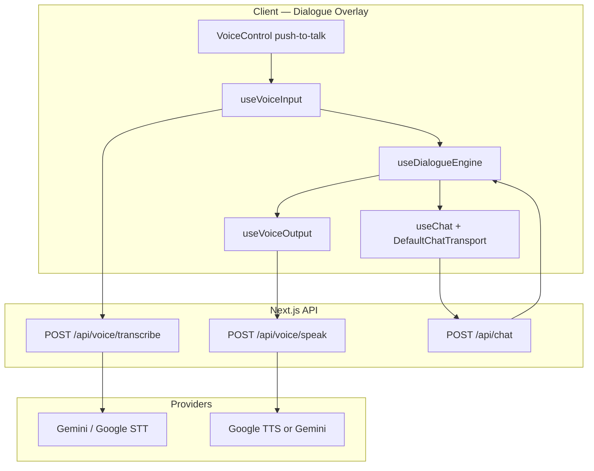

# Voice Chat — Nex Staff

## Goals

Add **voice input/output** to RPG dialogue — the user speaks with the Assistant/Staff like NPCs in a game, without turning Nex Staff into a conventional chat app.

**Principles:**

- Voice **supplements** text dialogue; it does not fully replace it
- A single agent flow: STT → text → `POST /api/chat` (current) → TTS
- Preserve immersion: typewriter NPC lines + optional voice readback; push-to-talk by default
- Staff async workflow **unchanged** — voice applies only to the sync Assistant dialogue layer

**Phases:** V1 (Phase 2) push-to-talk + TTS readback · V2 (Phase 3) streaming + chiptune SFX · V3 (TBD) duplex live session

---

## User stories

| ID     | Story                                                                                         | Acceptance criteria                                              |
| ------ | --------------------------------------------------------------------------------------------- | ---------------------------------------------------------------- |
| VC-01  | As a user, I hold the mic button and speak a brief task instead of typing                     | STT → text appears in dialogue input → submit like keyboard      |
| VC-02  | As a user, I hear the Assistant read the dialogue line after the typewriter                   | TTS plays after line complete; can be disabled in settings       |
| VC-03  | As a user, I select a choice by voice ("A", "Yes") when the menu is shown                     | STT maps to choice label/shortcut in `player-choice`             |
| VC-04  | As a user, I see clear mic status (idle / listening / processing)                             | Pixel mic indicator; no recording while Assistant is streaming     |
| VC-05  | As a user, the transcript is still saved in the chat log like a text message                  | `chat` / `chat_message` persistence unchanged                      |

---

## Architecture

Voice is an **adapter layer** on top of the existing dialogue — no fork of the agent runtime.



### V1 flow (push-to-talk)

1. User holds **mic** in `player-input` or `player-choice`
2. Browser records audio (WebM/Opus) → `POST /api/voice/transcribe` with `chatId`, `locale?`
3. Server returns `{ text, confidence? }` → fills `DialogueInput` or auto-submits if the user enabled it
4. `sendMessage` via the current transport → `/api/chat` (agent contract unchanged)
5. When NPC line typewriter completes → optional `POST /api/voice/speak` → play audio via `HTMLAudioElement`

### Why not send audio directly to `/api/chat`?

- Assistant tools, persistence, and `ToolLoopAgent` are standardized on **UIMessage text**
- Separating STT/TTS keeps boundaries clear, easy to test, easy to swap providers
- Phase 3 can add a separate **Gemini Live** session if duplex is needed — still sync transcript back to `chat`

---

## Phased scope

### V1 — Dialogue voice (Phase 2)

| Area        | Deliverable                                                                 |
| ----------- | --------------------------------------------------------------------------- |
| Input       | Push-to-talk mic on `DialogueInput`; transcript preview before send         |
| Output      | TTS readback for NPC lines (`npc-speaking`); global user toggle             |
| API         | `POST /api/voice/transcribe`, `POST /api/voice/speak`                       |
| UX          | Mic states: idle / listening / transcribing; disabled when `isBusy`         |
| Persistence | Save text transcript only (same as typed message)                            |
| Surfaces    | `DialogueOverlay` (Reception, staff, task-scoped assistant panel)           |

**Out of scope for V1:**

- Always-on listening / wake word
- Voice for Archive Room, Task Board (text-only overlays)
- Staff workflow voice (async layer)

### V2 — Polish (Phase 3, alongside chiptune SFX)

| Area     | Deliverable                                                              |
| -------- | ------------------------------------------------------------------------ |
| Input    | Streaming partial transcript; voice choice selection                     |
| Output   | Sentence-chunk TTS during stream (starts after first sentence)           |
| Audio UX | Chiptune blip SFX mic on/off; optional 8-bit voice filter post-processing |
| Settings | Per-user prefs: `voiceInputEnabled`, `voiceOutputEnabled`, `locale`      |

### V3 — Live session (TBD)

- Gemini Live API or WebRTC duplex for a “phone call with the Assistant”
- Interrupt barge-in when the user speaks during TTS
- Evaluate cost/latency before committing

---

## Directory structure (proposed)

Matches the current layout (`components/dialogue`, `hooks`, `lib`, `app/api`):

```
src/
├── app/api/voice/
│   ├── transcribe/route.ts      # Audio blob → text
│   └── speak/route.ts           # Text → audio (base64 or stream)
├── components/dialogue/
│   ├── dialogue-input.tsx       # + VoiceControl slot
│   └── voice-control.tsx        # Push-to-talk pixel mic button
├── hooks/
│   ├── use-voice-input.ts       # MediaRecorder, transcribe API
│   ├── use-voice-output.ts      # speak API, queue, interrupt
│   └── use-voice-preferences.ts # localStorage / user settings
└── lib/voice/
    ├── constants.ts             # MIME types, max duration, locales
    ├── server/
    │   ├── transcribe.ts        # Provider call (Gemini audio)
    │   └── synthesize.ts        # TTS provider call
    └── types.ts                 # VoiceTranscribeResult, VoiceSpeakRequest
```

**Integration points (existing):**

| File | Change |
| ---- | ------ |
| `dialogue-input.tsx` | Render `VoiceControl`; merge STT text into textarea |
| `use-dialogue-engine.ts` | Optional callback `onNpcLineComplete` → trigger TTS |
| `dialogue-overlay.tsx` | Wire `useVoiceOutput`; stop TTS on close/Esc |
| `choice-menu.tsx` | Optional voice pick via STT → `selectChoice` |
| `lib/chat/persistence.ts` | No change — messages remain text |

---

## API (planned)

REST details to be added to [API.md](API.md#voice-planned).

### `POST /api/voice/transcribe`

**Auth:** session required

**Request:** `multipart/form-data`

| Field    | Type   | Required | Description                    |
| -------- | ------ | -------- | ------------------------------ |
| `audio`  | file   | yes      | WebM/Opus or WAV, max 60s V1   |
| `chatId` | uuid   | no       | Audit / rate context           |
| `locale` | string | no       | e.g. `vi`, `en-US`             |

**Response:**

```json
{
  "text": "Write a blog post about AI agents for startup founders",
  "durationMs": 4200,
  "locale": "en-US"
}
```

### `POST /api/voice/speak`

**Auth:** session required

**Request:**

```json
{
  "text": "Delegated to Alex. You can continue chatting.",
  "speakerId": "assistant",
  "locale": "en-US"
}
```

**Response V1:** `audio/mpeg` or JSON `{ "audioBase64": "...", "contentType": "audio/mpeg" }`

**Limits:** truncate at ~500 chars per request V1; strip markdown for TTS

---

## UI/UX

See [UI-UX.md — Voice in Dialogue](UI-UX.md#voice-in-dialogue-planned).

| State           | Mic                         | TTS                                    |
| --------------- | --------------------------- | -------------------------------------- |
| `npc-speaking`  | Hidden / disabled           | Play after typewriter if enabled       |
| `player-choice` | Optional hold-to-speak      | Stop any playing NPC audio             |
| `player-input`  | Push-to-talk + text field   | Disabled                               |
| `isBusy`        | Disabled                    | Queue or skip until stream ends        |

**Pixel mic button** — same design system `#16`:

```
┌──────────────────────────────────────────────────┐
│  ▼ Hi boss                                       │
│  [transcript preview while holding mic...]         │
│                              [🎤] [Send ▶] [📎]   │
└──────────────────────────────────────────────────┘
```

- 🎤 hold = listening (border pulse `--color-sun-glow`)
- Release = transcribing spinner on mic
- Error = brief pixel toast "Couldn't hear that — try again"

**Accessibility:**

- Keyboard-only path unchanged
- `aria-pressed` on mic; live region for transcript
- Captions: dialogue text still displayed (voice does not replace visual)

---

## Provider strategy

Text generation defaults to **Google Gemini** (`@ai-sdk/google`). Set `LLM_PROVIDER=openrouter` to use OpenRouter instead (`@openrouter/ai-sdk-provider`). Voice STT/TTS remains Google-based regardless of `LLM_PROVIDER`.

| Capability | V1 recommendation | Fallback |
| ---------- | ------------------- | -------- |
| STT        | Gemini multimodal audio input (server-side) | Browser `SpeechRecognition` (Chrome only) |
| TTS        | Google Cloud Text-to-Speech or Gemini TTS API | `speechSynthesis` (dev/local only) |

**Env vars (planned):**

```bash
# LLM (text) — Google is default
LLM_PROVIDER=google
GOOGLE_GENERATIVE_AI_API_KEY=

# LLM (text) — optional OpenRouter backend
# LLM_PROVIDER=openrouter
# OPENROUTER_API_KEY=
# OPENROUTER_DEFAULT_MODEL=google/gemini-2.5-flash

# Optional V1 — if using Cloud TTS separately
GOOGLE_CLOUD_TTS_API_KEY=
# or service account for TTS
```

**Cost controls V1:**

- Max recording 60s per utterance
- Rate limit per user (defer to Phase 4 Redis — document intent in API)
- Skip TTS when `voiceOutputEnabled === false`

---

## Data model

**V1: no schema change.** Transcripts persist as existing `chat_message` text parts.

**V2 (optional):** `user.metadata.voicePreferences`:

```typescript
interface VoicePreferences {
  inputEnabled: boolean;
  outputEnabled: boolean;
  locale: string;
  speakerVoiceId?: string; // TTS voice mapping per assistant/staff
}
```

**Do not store raw audio** in V1 (privacy + storage). Optional debug flag in dev only.

---

## Dialogue state integration

```typescript
// hooks/use-voice-session.ts (conceptual)
interface UseVoiceSessionOptions {
  chatId: string;
  speakerId: string;
  enabled: boolean;
  onTranscript: (text: string) => void;
  onError: (message: string) => void;
}

interface UseVoiceSessionResult {
  state: "idle" | "listening" | "transcribing" | "speaking";
  startListening: () => void;
  stopListening: () => void;
  stopSpeaking: () => void;
  isSupported: boolean;
}
```

Hook composed in `DialogueOverlayPanel` — do not put voice logic inside `ToolLoopAgent`.

---

## Testing & eval

| Test type | Scope |
| --------- | ----- |
| Unit      | `lib/voice/server/transcribe` mock provider; markdown strip for TTS |
| Integration | `POST /api/voice/transcribe` with fixture audio blob |
| E2E       | Playwright: hold mic → mock transcribe → message in dialogue log |
| Manual    | VI + EN short phrases; hire/delegate vocabulary |

**Eval (future):** STT word error rate on 20 in-domain phrases (staff names, "delegate", "blog").

---

## Risks

| Risk | Impact | Mitigation |
| ---- | ------ | ---------- |
| Browser mic permissions denied | Feature unusable | Clear pixel prompt; fallback text-only |
| STT accuracy (Vietnamese) | Wrong delegate/hire | Show transcript before send V1; user edit |
| TTS latency | Breaks RPG pacing | Start TTS after typewriter; allow skip |
| Audio autoplay policies | TTS silent until gesture | First mic use unlocks audio context |
| Cost per minute | High usage bills | Duration caps; off by default for output |
| Gemini Live API churn | V3 blocked | V1/V2 provider-agnostic adapter layer |

---

## Acceptance criteria (V1)

- [ ] Push-to-talk in `DialogueOverlay` produces text message → same `/api/chat` stream as keyboard
- [ ] NPC line TTS optional, toggle in session (localStorage minimum)
- [ ] Mic disabled while Assistant streaming (`isBusy`)
- [ ] Transcript appears in Dialogue Log overlay
- [ ] Works on Chrome + Firefox desktop; graceful degrade Safari
- [ ] No raw audio persisted in production

---

## Dependencies

| Dependency | Required by |
| ---------- | ----------- |
| Dialogue overlay stable (#5) | V1 |
| `/api/chat` + persistence | V1 |
| Pixel design system (#16) | V1 mic button |
| Google STT/TTS or Gemini audio | V1 |
| Chiptune SFX (#ROADMAP Phase 3) | V2 polish |

## Related docs

- [UI-UX.md](UI-UX.md) — Dialogue states, immersion rules
- [ARCHITECTURE.md](ARCHITECTURE.md) — Client/API layers
- [API.md](API.md) — REST contract
- [VOICE-CHAT.md](VOICE-CHAT.md) — Voice input/output plan
- [ROADMAP.md](ROADMAP.md) — Phase 2/3 placement
- [PRD.md](PRD.md) — US-14 voice user story

Part of #2
